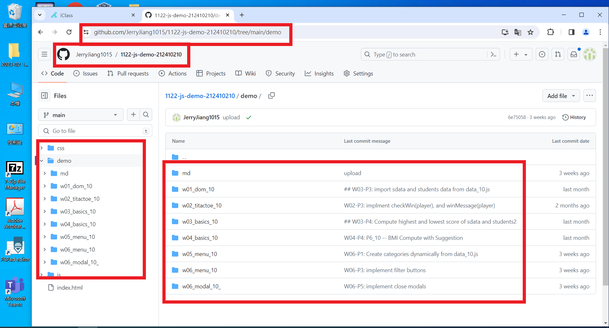

# (50%) JavaScript 網頁設計 1N 期中上機考-2 -- 開放考試

##### 2024-4-18 at E201

#### Note:

1. 請不要發揮同學愛，作弊雙方除了本次考試 0 分外，平常分數另扣 20 分，情節嚴重者會送校。
2. iClass 上請繳交 mid22_xx.md, mid22_xx.pdf，還有最上層選單 index.html, js/script_demo_xx.js 四個檔
3. 請直接將答案寫在 mid22_xx.md 上，老師實作的圖片放在 mid22_htc.pdf 上，請依照老師所給的圖片來實作並標註
4. 跟期中考相關的檔案及目錄名稱有 xx 時，必須要改成學號後 2 碼，沒有修改時，會視違犯情況扣分。
5. 每一張圖片要有機房左側背景，圖片上要有你的學號(或後兩碼)，圖片標註要跟老師所標註的類似。違者會依情節扣分。
6. 請自評分數，將每一題的 ? 填入分數，沒有填者，不會批改，以 0 分計算。

##### Your (Name, ID): (江宇鵬, 212410210)

##### Mid22 開放網路題目 (50%)

- P1-1 (6%): 6 分
- P1-2 (6%): 6 分
- P1-3 (6%): 6 分
- P1-4 (6%): 6 分
- P1-5 (6%): 6 分
- P2 (14%): 14 分
- P3 (6%): 6 分

##### 總分: 50 分

---

## (30%) P1: Show Info of Your Github Repo and Vercel

#### (6%) P1-1: Show Your Github Repo for class demo

##### => My Github repo URL

[https://github.com/JerryJiang1015/1122-js-demo-212410210](https://github.com/JerryJiang1015/1122-js-demo-212410210)



#### Your Answer


---

#### (6%) P1-2: Show all your git logs

##### => My Github URL for git logs

[https://github.com/JerryJiang1015/1122-js-demo-212410210](https://github.com/JerryJiang1015/1122-js-demo-212410210)

用下列指令將 git log 紀錄放入 gitlog.txt 中，然後讀進 VS Code，將 W1, W2, W3, W4, W5, W6 週的 git log 記錄標註

```
 git log --pretty=format:"%h%x09%an%x09%ad%x09%s" --after="2024-02-19" > gitlog.txt
```


#### Your Answer


---

#### (6%) P1-3: Show Your Vercel URL for class demo

##### => My Vercel URL

[https://1122-js-demo-xx.vercel.app/](https://1122-js-demo-xx.vercel.app/)

請標註右上兩個 icon 對應的 URL，一個連到你的 Github，一個連到你的 Vercel


#### Your Answer


---

#### (6%) P1-4: In Vercel, show W4-P5 demo for 2 tours

要選 Class Demo 選單，看下面是否有 W1~W6 每週的項目。點選 W4-P5_xx Tour 顯示 2 個 tours，並在 DevTools 看到相對應的 html code


#### Your Answer


---

#### (6%) P1-5: 請在 W4-P5 新增一個屬於台灣的 tour，圖片可自 unsplash 網站搜尋取得，內容可自訂


#### Your Answer


---

## (14%) P2: 請將斷網考試的 p1_xx, p2_xx, p3_xx 放入 class demo 最外層的選單中，並能在 local 端顯示。

##### => local, 將 p1_xx, p2_xx, p3_xx 放入 Github class demo repo 中，目錄及檔案結構如下圖，在 index.html 檔中 showdemo()所傳入的字串請用下圖老師所寫的，要帶學號後兩碼如下。

```
mid21-p1_xx
mid21_p2_xx
mid21_p3_xx
```


##### => local, 顯示 p1_xx 於下圖選單中，直接從上選單 Class Demo 中選


##### => local, 顯示 p2_xx 於下圖選單中，直接從上選單 Class Demo 中選


##### => local, 顯示 p3_xx 於下圖選單中，請使用 sidebar 選單 Class Demo 中選


#### Your Answer

##### => local, 將 p1_xx, p2_xx, p3_xx 放入 Github class demo repo 中，目錄及檔案結構如下：


##### => local, 顯示 p1_xx 於下圖選單中，直接從上選單 Class Demo 中選


##### => local, 顯示 p2_xx 於下圖選單中，直接從上選單 Class Demo 中中選


##### => local, 顯示 p3_xx 於下圖選單中，請使用 sidebar 選單 Class Demo 中選


##### => local, 顯示 showdemo() 相關 code

```
顯示 showdemo() 相關 code
```

---

## (6%) P3: 請將 P2 題 git push 到 Github 後，p1_xx, p2_xx, p3_xx 能夠在 Vercel 上顯示

##### => Vercel, 顯示 p1_xx 於下圖選單中


##### => Vercel, 顯示 p2_xx 於下圖選單中


##### => Vercel, 顯示 p3_xx 於下圖選單中


#### Your Answer

##### => Vercel, 顯示 p1_xx 於下圖選單中


##### => Vercel, 顯示 p2_xx 於下圖選單中


##### => Vercel, 顯示 p3_xx 於下圖選單中


