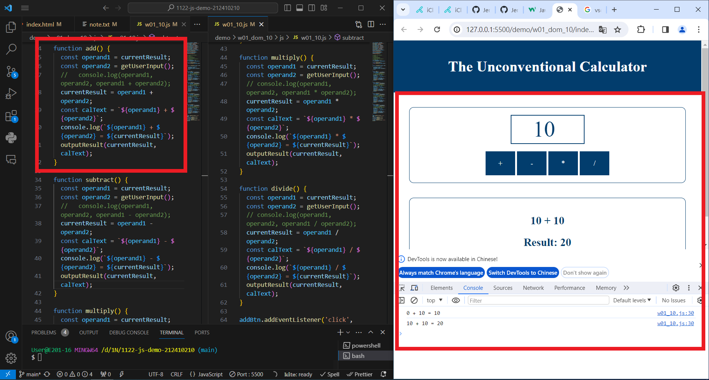
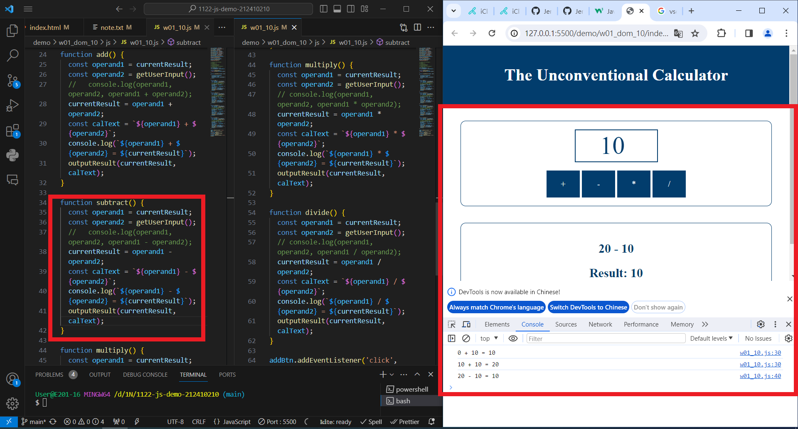
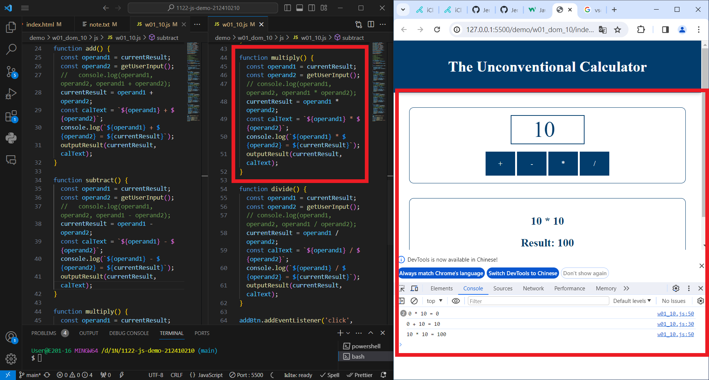
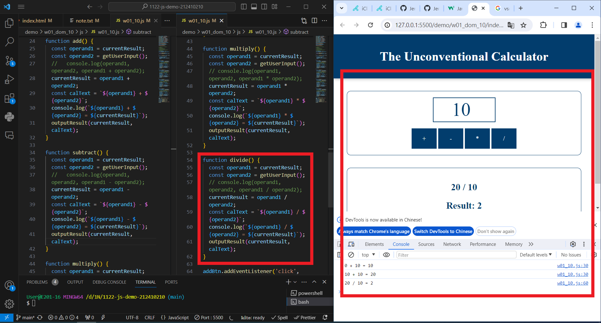

### W01-P1 : Show the wo1-dom title


```
git log --pretty=format:"%h%x09%an%x09%ad%x09%s" --after="2024-02-21"
fd05f6f “JerryJiang1015” Thu Feb 22 19:35:27 2024 +0800  W01-P1 : Show the wo1-dom title
```

### W01-P2: implement add function



```
git log --pretty=format:"%h%x09%an%x09%ad%x09%s" --after="2024-02-21"
e5de44b “JerryJiang1015” Thu Feb 22 21:21:55 2024 +0800  W01-P2: implement add function
fd05f6f “JerryJiang1015” Thu Feb 22 19:35:27 2024 +0800  W01-P1 : Show the wo1-dom title
```

### W01-P3: implement subtract function



```
git log --pretty=format:"%h%x09%an%x09%ad%x09%s" --after="2024-02-21"
46070ae “JerryJiang1015” Thu Feb 22 21:14:20 2024 +0800  W01-P3: implement subtract function
e5de44b “JerryJiang1015” Thu Feb 22 21:21:55 2024 +0800  W01-P2: implement add function
fd05f6f “JerryJiang1015” Thu Feb 22 19:35:27 2024 +0800  W01-P1 : Show the wo1-dom title
```

### W01-P4: implement multiply function



### W01-P5: implement divide function


