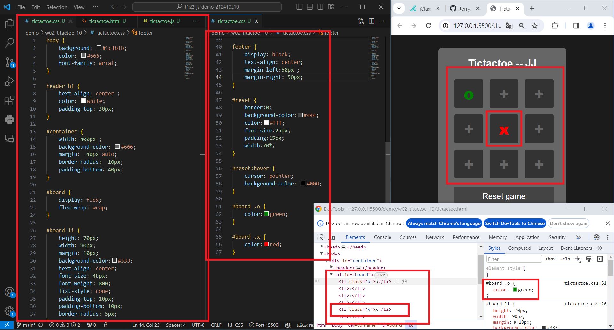
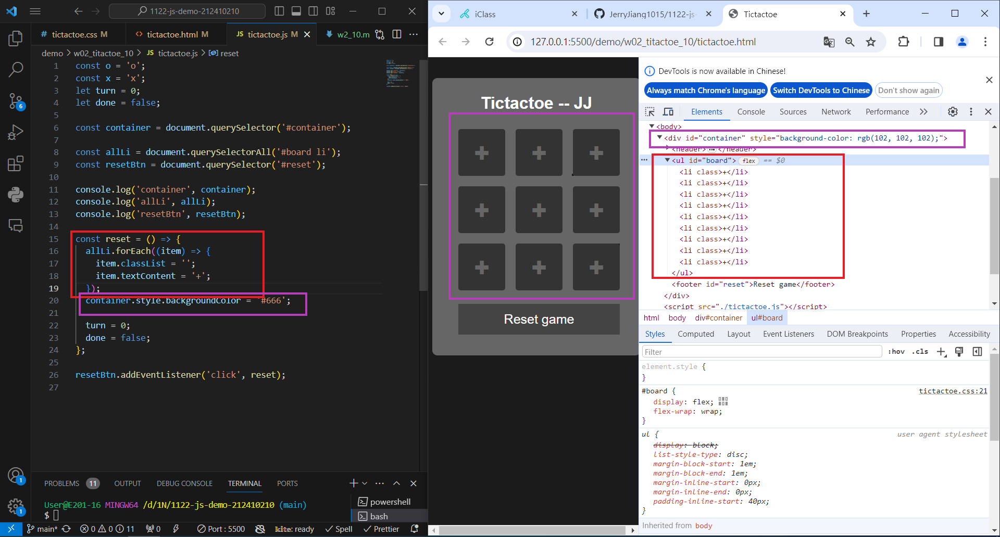
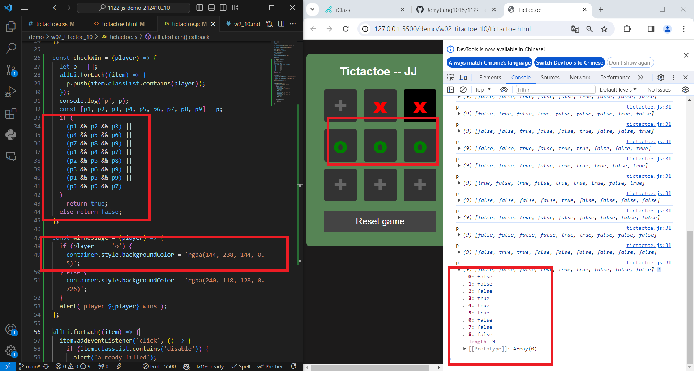
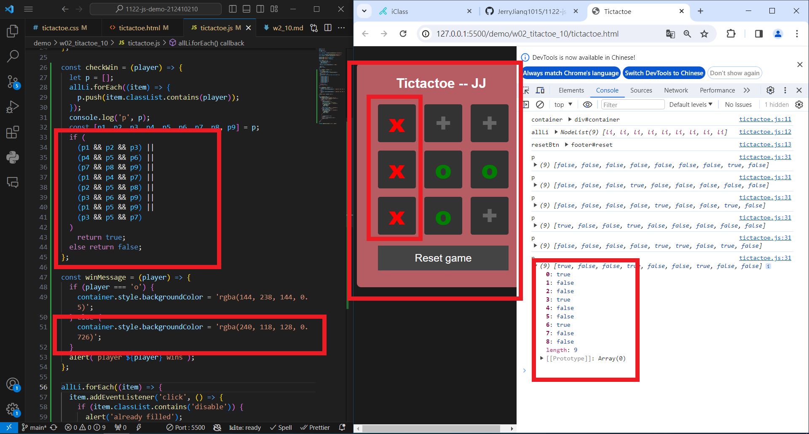
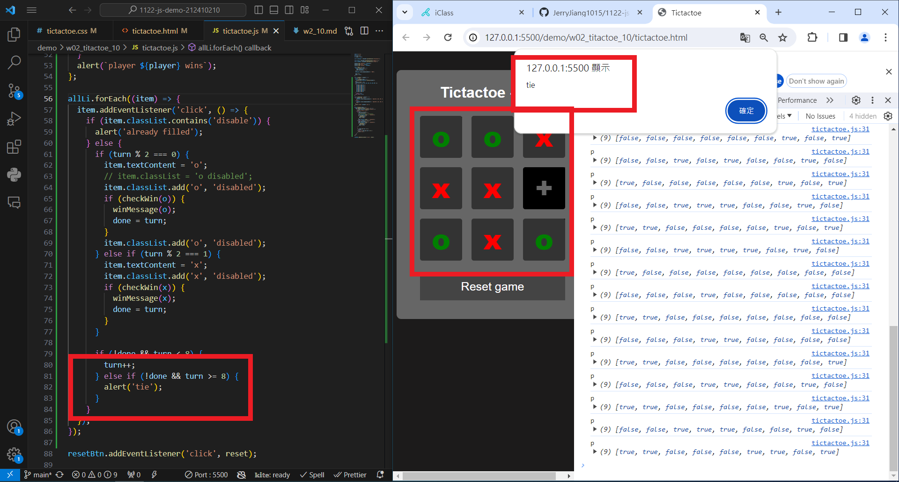

### W02-P1: Show Tictactoe css



```
git log --pretty=format:"%h%x09%an%x09%ad%x09%s" --after="2024-02-21"
fd05f6f “JerryJiang1015” Thu Feb 22 19:35:27 2024 +0800  W01-P1 : Show the wo1-dom title
```

### W02-P2: implement reset button



```
$ git log --pretty=format:"%h%x09%an%x09%ad%x09%s" --after="2024-02-28"
aa46ff1 “JerryJiang1015” Thu Feb 29 19:57:05 2024 +0800        W02-P2: implement reset button
0397ade “JerryJiang1015” Thu Feb 29 19:03:48 2024 +0800        W02-P1: Show Tictactoe css
```

### W02-P3: implment checkWin(player), and winMessage(player)

#### => player O wins



#### => player X wins



#### => tie game



```
git log --pretty=format:"%h%x09%an%x09%ad%x09%s" --after="2024-02-21"
46070ae “JerryJiang1015” Thu Feb 22 21:14:20 2024 +0800  W01-P3: implement subtract function
e5de44b “JerryJiang1015” Thu Feb 22 21:21:55 2024 +0800  W01-P2: implement add function
fd05f6f “JerryJiang1015” Thu Feb 22 19:35:27 2024 +0800  W01-P1 : Show the wo1-dom title
```

### W02-P4: git logs for W02


