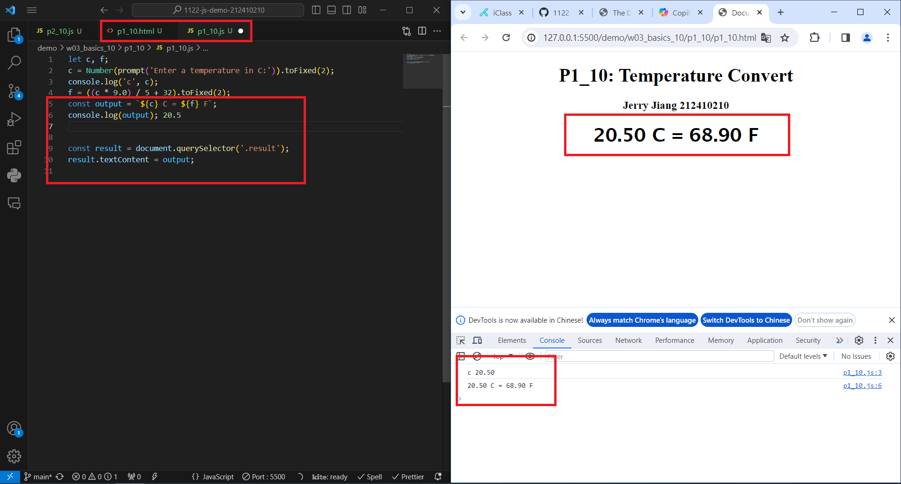
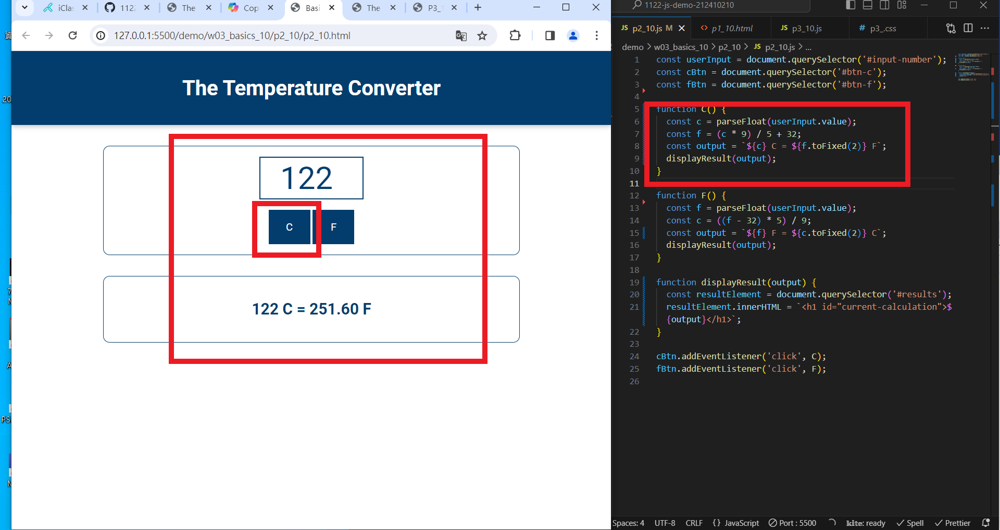
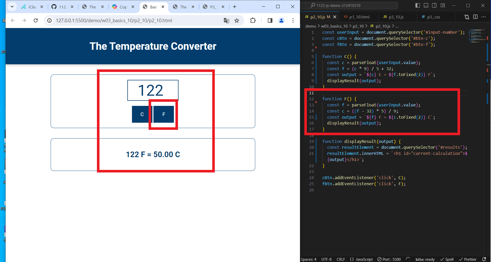
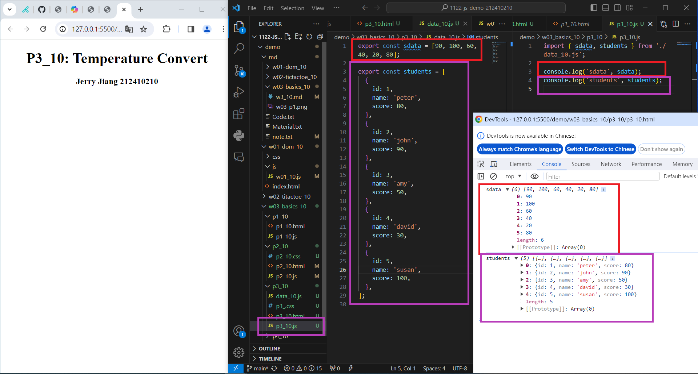
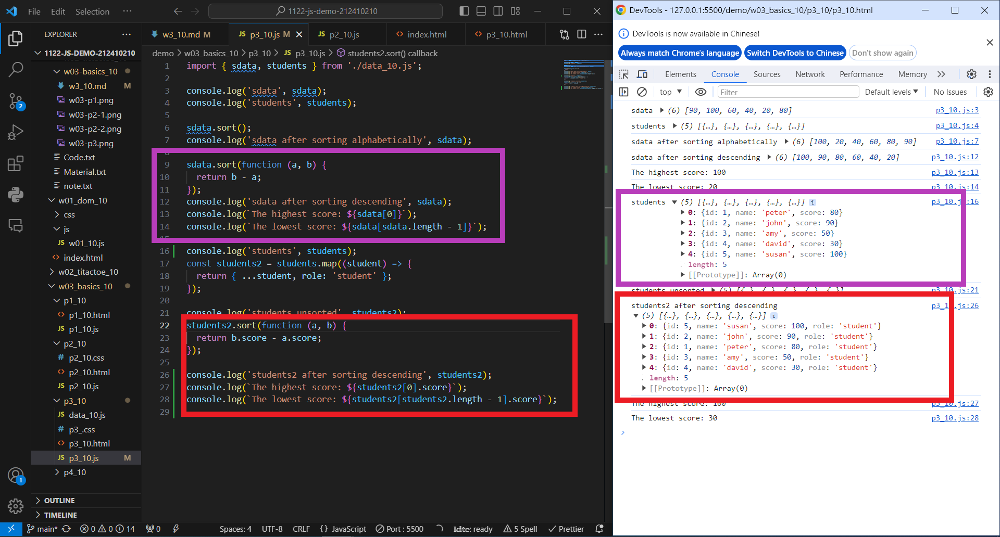
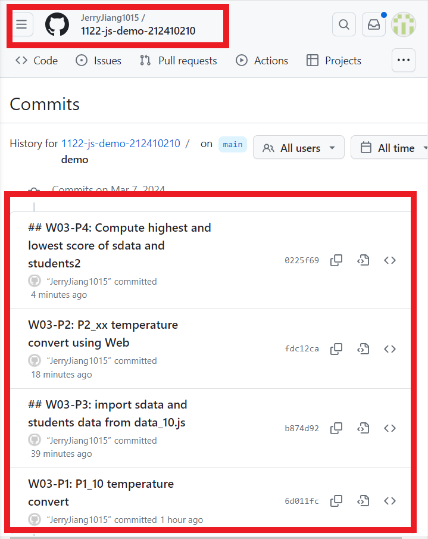

[My Github URL](https://github.com/JerryJiang1015/1122-js-demo-212410210)

### W03-P1: P1_10 temperature convert



```
$ git log --pretty=format:"%h%x09%an%x09%ad%x09%s" --after="2024-03-06"
6d011fc “JerryJiang1015”        Thu Mar 7 19:12:01 2024 +0800   W03-P1: P1_10 temperature convert
```

### W03-P2: P2_xx temperature convert using Web





```
$ git log --pretty=format:"%h%x09%an%x09%ad%x09%s" --after="2024-03-06"
fdc12ca “JerryJiang1015”        Thu Mar 7 20:41:33 2024 +0800   W03-P2: P2_xx temperature convert using Web
6d011fc “JerryJiang1015”        Thu Mar 7 19:12:01 2024 +0800   W03-P1: P1_10 temperature convert
```

### W03-P3: import sdata and students data from data_10.js



```
$ git log --pretty=format:"%h%x09%an%x09%ad%x09%s" --after="2024-03-06"
fdc12ca “JerryJiang1015”        Thu Mar 7 20:41:33 2024 +0800   W03-P2: P2_xx temperature convert using Web
b874d92 “JerryJiang1015”        Thu Mar 7 20:20:09 2024 +0800   ## W03-P3: import sdata and students data from data_10.js
6d011fc “JerryJiang1015”        Thu Mar 7 19:12:01 2024 +0800   W03-P1: P1_10 temperature convert
```

### W03-P4: Compute highest and lowest score of sdata and students2



```
$ git log --pretty=format:"%h%x09%an%x09%ad%x09%s" --after="2024-03-06"
0225f69 “JerryJiang1015”        Thu Mar 7 20:54:45 2024 +0800   ## W03-P4: Compute highest and lowest score of sdata and students2
fdc12ca “JerryJiang1015”        Thu Mar 7 20:41:33 2024 +0800   W03-P2: P2_xx
temperature convert using Web
b874d92 “JerryJiang1015”        Thu Mar 7 20:20:09 2024 +0800   ## W03-P3: import sdata and students data from data_10.js
6d011fc “JerryJiang1015”        Thu Mar 7 19:12:01 2024 +0800   W03-P1: P1_10
temperature convert
```

### W03-P5: git logs for W03


