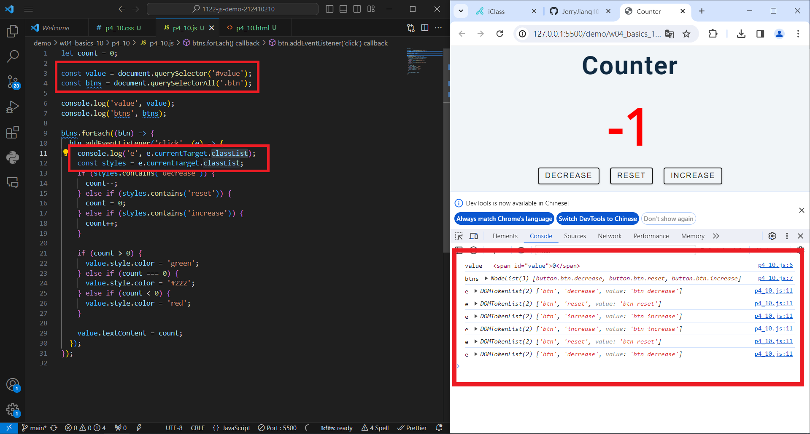
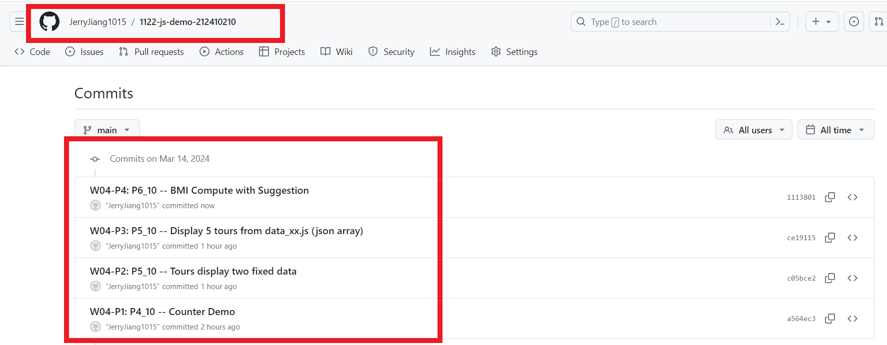

[My Github URL](https://github.com/JerryJiang1015/1122-js-demo-212410210)

### W04-P1: P4_10 -- Counter Demo




```
$ git log --pretty=format:"%h%x09%an%x09%ad%x09%s" --after="2024-03-13"
a564ec3 “JerryJiang1015”        Thu Mar 14 19:05:56 2024 +0800  W04-P1: P4_10 -- Counter Demo

### W04-P2: P2_xx temperature convert using Web


```

$ git log --pretty=format:"%h%x09%an%x09%ad%x09%s" --after="2024-03-06"
fdc12ca “JerryJiang1015” Thu Mar 7 20:41:33 2024 +0800 W04-P2: P2_xx temperature convert using Web
6d011fc “JerryJiang1015” Thu Mar 7 19:12:01 2024 +0800 W04-P1: P1_10 temperature convert

```

### W04-P3: import sdata and students data from data_10.js


```

$ git log --pretty=format:"%h%x09%an%x09%ad%x09%s" --after="2024-03-06"
fdc12ca “JerryJiang1015” Thu Mar 7 20:41:33 2024 +0800 W04-P2: P2_xx temperature convert using Web
b874d92 “JerryJiang1015” Thu Mar 7 20:20:09 2024 +0800 ## W04-P3: import sdata and students data from data_10.js
6d011fc “JerryJiang1015” Thu Mar 7 19:12:01 2024 +0800 W04-P1: P1_10 temperature convert

```

### W04-P4: Compute highest and lowest score of sdata and students2


```

$ git log --pretty=format:"%h%x09%an%x09%ad%x09%s" --after="2024-03-06"
0225f69 “JerryJiang1015” Thu Mar 7 20:54:45 2024 +0800 ## W04-P4: Compute highest and lowest score of sdata and students2
fdc12ca “JerryJiang1015” Thu Mar 7 20:41:33 2024 +0800 W04-P2: P2_xx
temperature convert using Web
b874d92 “JerryJiang1015” Thu Mar 7 20:20:09 2024 +0800 ## W04-P3: import sdata and students data from data_10.js
6d011fc “JerryJiang1015” Thu Mar 7 19:12:01 2024 +0800 W04-P1: P1_10
temperature convert

```

### W04-P5: git logs for W04


```
