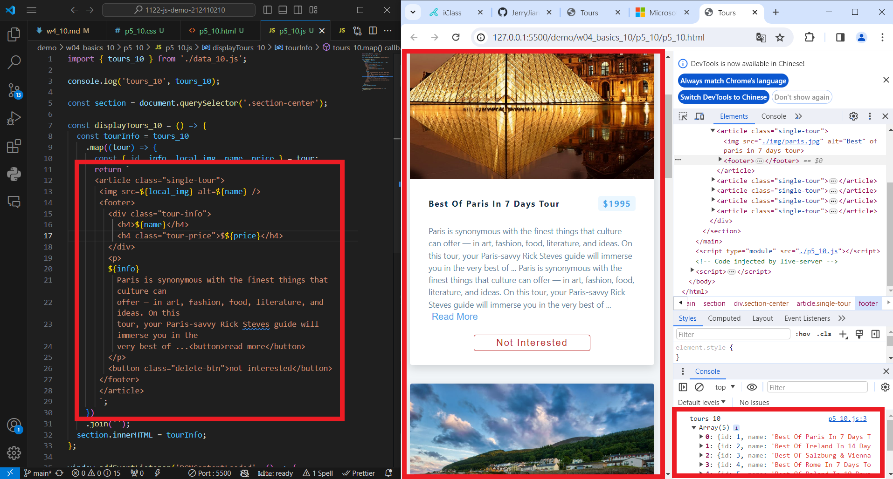
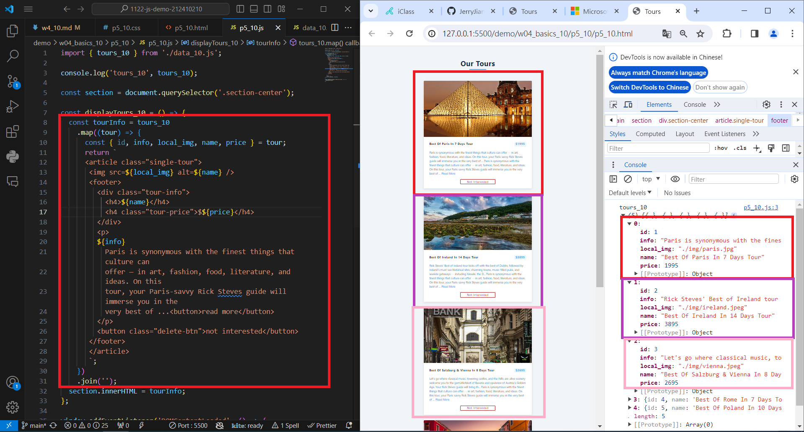
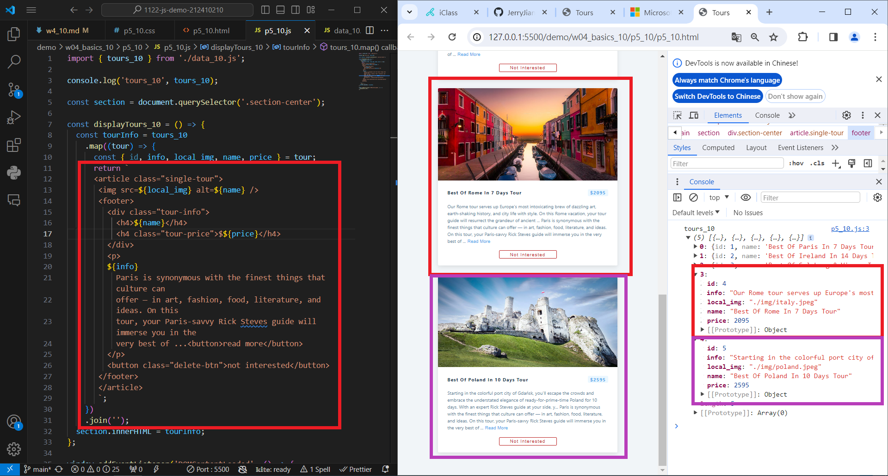
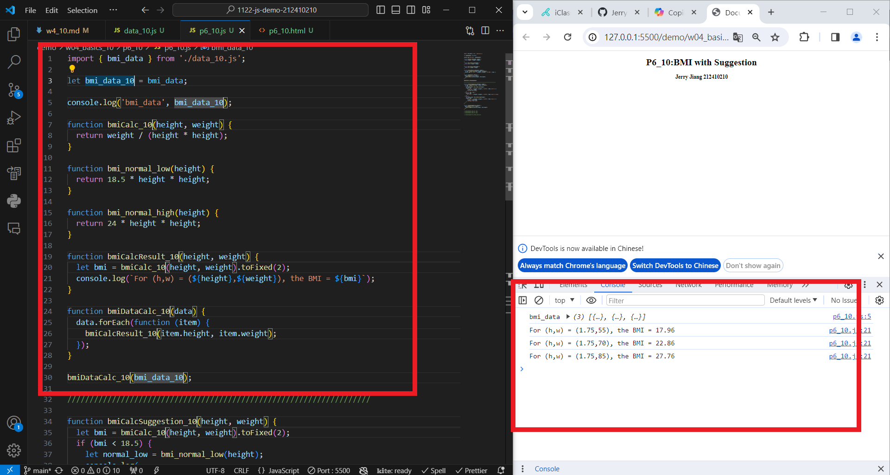
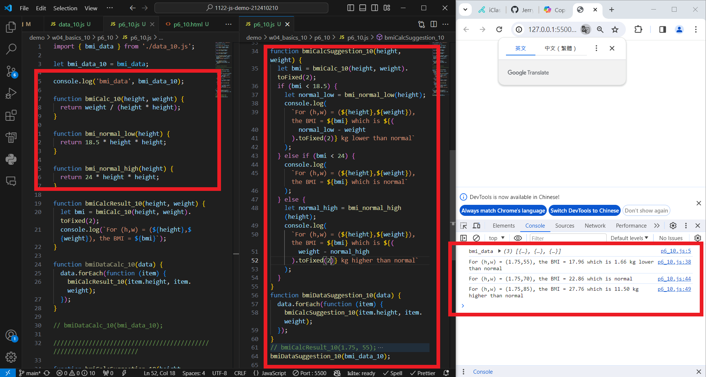
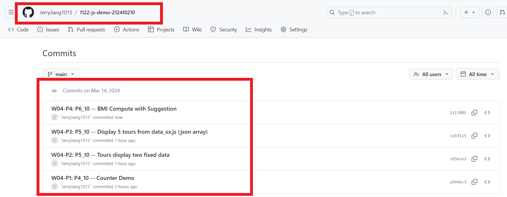

[My Github URL](https://github.com/JerryJiang1015/1122-js-demo-212410210)

### W05-P1: Use megamenu to show class demo w1~W4 locally


```
$ git log --pretty=format:"%h%x09%an%x09%ad%x09%s" --after="2024-03-13"
a564ec3 “JerryJiang1015”        Thu Mar 14 19:05:56 2024 +0800  W04-P1: P4_10 -- Counter Demo
```

### W04-P2: P5_10 -- Tours display two fixed data



```

$ git log --pretty=format:"%h%x09%an%x09%ad%x09%s" --after="2024-03-13"
c05bce2 “JerryJiang1015”        Thu Mar 14 20:17:37 2024 +0800  W04-P2: P5_10 -- Tours display two fixed data
a564ec3 “JerryJiang1015”        Thu Mar 14 19:05:56 2024 +0800  W04-P1: P4_10 -- Counter Demo

```

### W04-P3: P5_10 -- Display 5 tours from data_xx.js (json array)





```

$ git log --pretty=format:"%h%x09%an%x09%ad%x09%s" --after="2024-03-13"
ce19115 “JerryJiang1015”        Thu Mar 14 20:25:03 2024 +0800  W04-P3: P5_10 -- Display 5 tours from data_xx.js (json array)
c05bce2 “JerryJiang1015”        Thu Mar 14 20:17:37 2024 +0800  W04-P2: P5_10 -- Tours display two fixed data
a564ec3 “JerryJiang1015”        Thu Mar 14 19:05:56 2024 +0800  W04-P1: P4_10 -- Counter Demo

```

### W04-P4: P6_10 -- BMI Compute with Suggestion

#### => bmiDataCalc(bmi_data_xx);



#### => bmiDataCalcSuggestion(bmi_data_xx);



```

$ git log --pretty=format:"%h%x09%an%x09%ad%x09%s" --after="2024-03-13"
1113801 “JerryJiang1015”        Thu Mar 14 21:23:36 2024 +0800  W04-P4: P6_10 -- BMI Compute with Suggestionce19115 “JerryJiang1015”        Thu Mar 14 20:25:03 2024 +0800  W04-P3: P5_10 -- Display 5 tours from data_xx.js (json array)
c05bce2 “JerryJiang1015”        Thu Mar 14 20:17:37 2024 +0800  W04-P2: P5_10 -- Tours display two fixed data
a564ec3 “JerryJiang1015”        Thu Mar 14 19:05:56 2024 +0800  W04-P1: P4_10 -- Counter Demo

```

### W04-P5: git logs for W04



```

```
