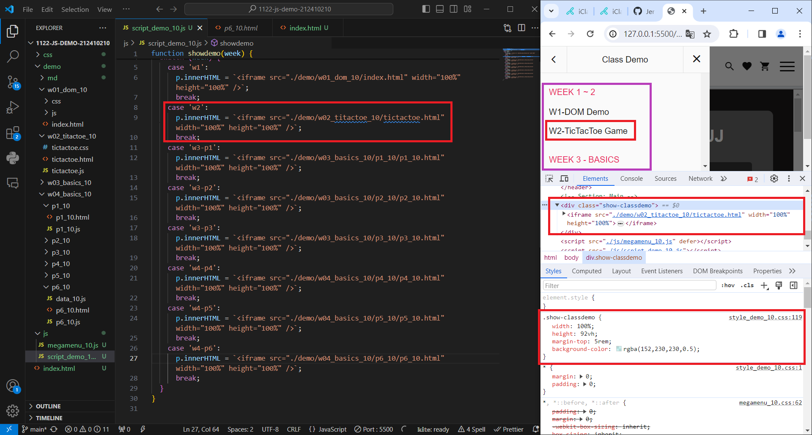
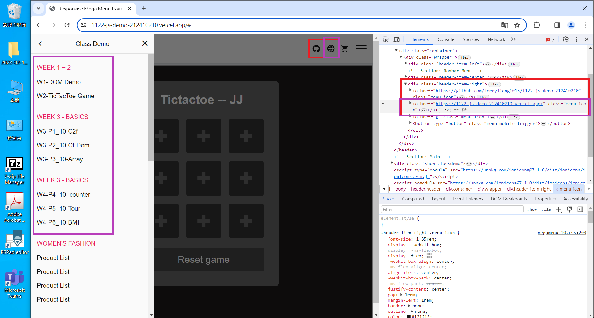
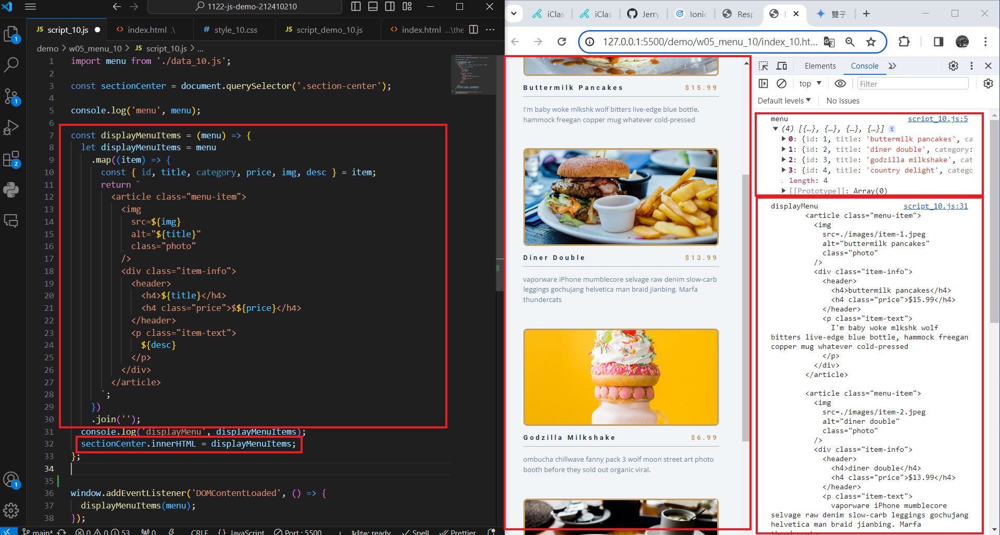
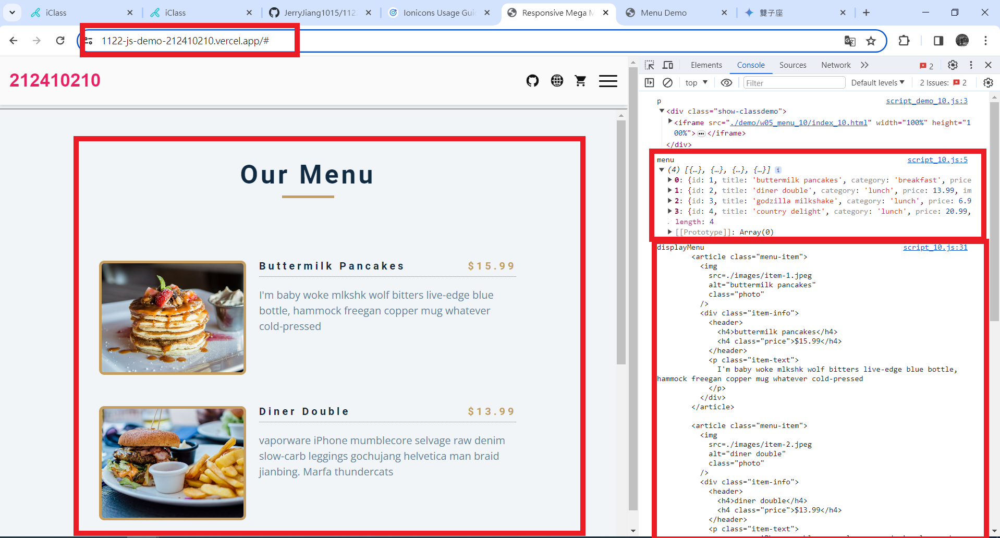
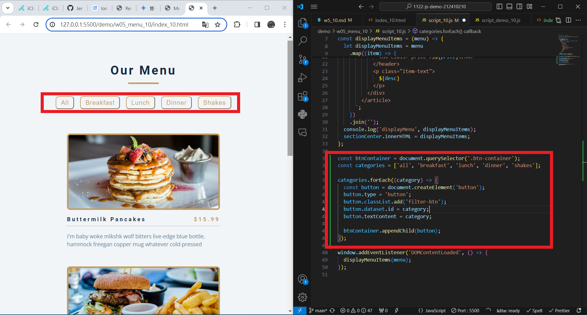
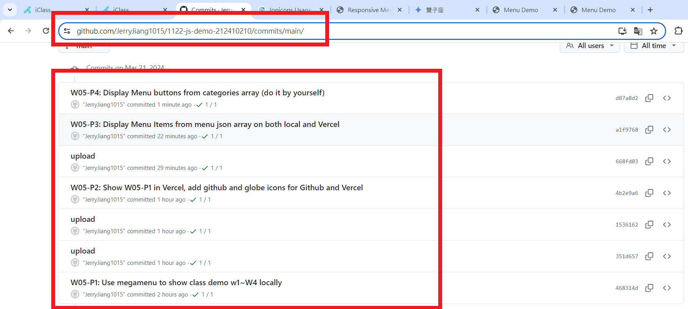

[My Github URL](https://github.com/JerryJiang1015/1122-js-demo-212410210)
[Vercel](https://1122-js-demo-212410210.vercel.app/#)

### W05-P1: Use megamenu to show class demo w1~W4 locally



```
$ git log --pretty=format:"%h%x09%an%x09%ad%x09%s" --after="2024-03-20"
468314d “JerryJiang1015”        Thu Mar 21 19:08:37 2024 +0800  W05-P1: Use megamenu to show class demo w1~W4 locally
```

### W05-P2: Show W05-P1 in Vercel, add github and globe icons for Github and Vercel



```
$ git log --pretty=format:"%h%x09%an%x09%ad%x09%s" --after="2024-03-20"
4b2e9a6 “JerryJiang1015”        Thu Mar 21 19:38:47 2024 +0800  W05-P2: Show W05-P1 in Vercel, add github and globe icons for Github and Vercel
1536162 “JerryJiang1015”        Thu Mar 21 19:34:00 2024 +0800  upload
351d657 “JerryJiang1015”        Thu Mar 21 19:24:34 2024 +0800  upload
468314d “JerryJiang1015”        Thu Mar 21 19:08:37 2024 +0800  W05-P1: Use megamenu to show class demo w1~W4 locally

```

### W05-P3: Display Menu Items from menu json array on both local and Vercel

#### > local



#### > Vercel



```

$ git log --pretty=format:"%h%x09%an%x09%ad%x09%s" --after="2024-03-13"5ce19115 “JerryJiang1015”        Thu Mar 14 20:25:03 2024 +0800  W04-P3: P5_10 -- Display 5 tours from data_xx.js (json array)
c05bce5 “JerryJiang1015”        Thu Mar 14 20:17:37 2024 +0800  W04-P2: P5_10 -- Tours display two fixed data
a564ec5 “JerryJiang1015”        Thu Mar 14 19:05:56 2024 +0800  W04-P1: P4_10 -- Counter Demo

```

### W05-P4: Display Menu buttons from categories array (do it by yourself)



```

$ git log --pretty=format:"%h%x09%an%x09%ad%x09%s" --after="2024-03-20"
d87a8d2 “JerryJiang1015”        Thu Mar 21 21:08:54 2024 +0800  W05-P4: Display Menu buttons from categories array (do it by yourself)
a1f9768 “JerryJiang1015”        Thu Mar 21 20:47:48 2024 +0800  W05-P3: Display Menu Items from menu json array on both local and Vercel
668fd03 “JerryJiang1015”        Thu Mar 21 20:40:47 2024 +0800  upload
4b2e9a6 “JerryJiang1015”        Thu Mar 21 19:38:47 2024 +0800  W05-P2: Show W05-P1 in Vercel, add github and globe icons for Github and Vercel
1536162 “JerryJiang1015”        Thu Mar 21 19:34:00 2024 +0800  upload
351d657 “JerryJiang1015”        Thu Mar 21 19:24:34 2024 +0800  upload
468314d “JerryJiang1015”        Thu Mar 21 19:08:37 2024 +0800  W05-P1: Use megamenu to show class demo w1~W4 locally
```

### W05-P5: git logs for W04



```

```
