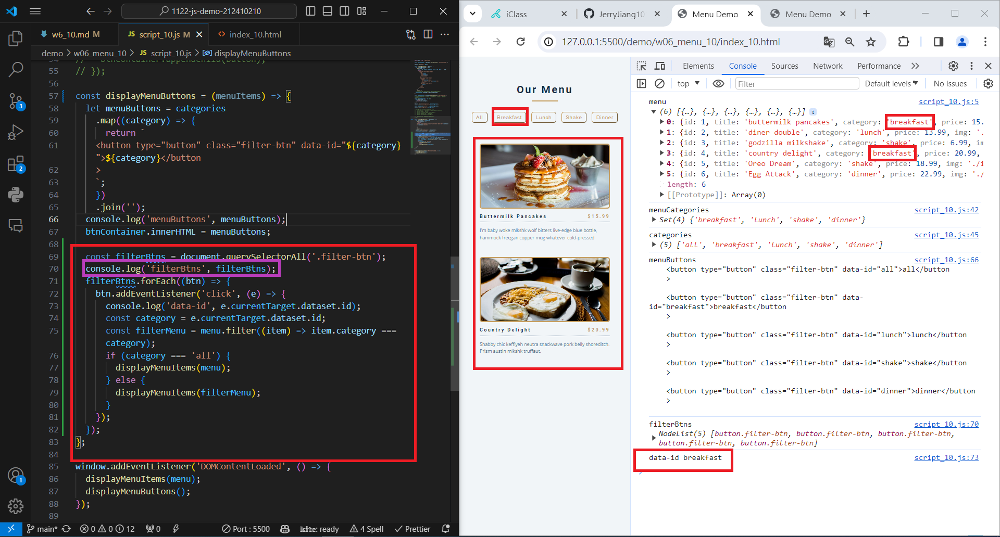

[My Github URL](https://github.com/JerryJiang1015/1122-js-demo-212410210)
[Vercel](https://1122-js-demo-212410210.vercel.app/#)

### W06-P1: Create categories dynamically from data_10.js


```
$ git log --pretty=format:"%h%x09%an%x09%ad%x09%s" --after="2024-03-27"
c0f6db3 “JerryJiang1015”        Thu Mar 28 19:58:28 2024 +0800  W06-P1: Create categories dynamically from data_10.js
```

### W06-P2: Display Menu buttons from categories array


```
$ git log --pretty=format:"%h%x09%an%x09%ad%x09%s" --after="2024-03-27"
9a9046a “JerryJiang1015”        Thu Mar 28 20:25:06 2024 +0800  W06-P2: Display Menu buttons from categories array
c0f6db3 “JerryJiang1015”        Thu Mar 28 19:58:28 2024 +0800  W06-P1: Create categories dynamically from data_10.js

```

### W06-P3: implement filter buttons

#### => choose breakfast



#### => choose shakes


#### => choose all


```

$ git log --pretty=format:"%h%x09%an%x09%ad%x09%s" --after="2024-03-27"
317a47a “JerryJiang1015”        Thu Mar 28 20:55:53 2024 +0800  W06-P3: implement filter buttons
9a9046a “JerryJiang1015”        Thu Mar 28 20:25:06 2024 +0800  W06-P2: Display Menu
buttons from categories array
c0f6db3 “JerryJiang1015”        Thu Mar 28 19:58:28 2024 +0800  W06-P1: Create categories dynamically from data_10.js

```

### W06-P4: implement open modals


```

$ git log --pretty=format:"%h%x09%an%x09%ad%x09%s" --after="2024-03-27"
7e5698f “JerryJiang1015”        Thu Mar 28 22:03:03 2024 +0800  W06-P4: implement open modals
317a47a “JerryJiang1015”        Thu Mar 28 20:55:53 2024 +0800  W06-P3: implement filter buttons9a9046a “JerryJiang1015”        Thu Mar 28 20:25:06 2024 +0800  W06-P2: Display Menu buttons from categories array
c0f6db3 “JerryJiang1015”        Thu Mar 28 19:58:28 2024 +0800  W06-P1: Create categories dynamically from data_10.js


```

### W06-P4: implement open modals


```

$ git log --pretty=format:"%h%x09%an%x09%ad%x09%s" --after="2024-03-27"
317a47a “JerryJiang1015”        Thu Mar 28 20:55:53 2024 +0800  W06-P3: implement filter buttons
9a9046a “JerryJiang1015”        Thu Mar 28 20:25:06 2024 +0800  W06-P2: Display Menu
buttons from categories array
c0f6db3 “JerryJiang1015”        Thu Mar 28 19:58:28 2024 +0800  W06-P1: Create categories dynamically from data_10.js

```

### W06-P5: implement close modals
 


```

$ git log --pretty=format:"%h%x09%
an%x09%ad%x09%s" --after="2024-03-27"
b9865fe JerryJiang1015  Sat Mar 30 10:14:43 2024 +0000  W06-P5: implement close modals
1ebba30 JerryJiang1015  Sat Mar 30 09:46:35 2024 +0800  Update index.html
fc9adbf “JerryJiang1015”        Thu Mar 28 22:04:17 2024 +0800  upload
7e5698f “JerryJiang1015”        Thu Mar 28 22:03:03 2024 +0800  W06-P4: implement open modals
317a47a “JerryJiang1015”        Thu Mar 28 20:55:53 2024 +0800  W06-P3: implement filter buttons
9a9046a “JerryJiang1015”        Thu Mar 28 20:25:06 2024 +0800  W06-P2: Display Menu buttons from categories array
c0f6db3 “JerryJiang1015”        Thu Mar 28 19:58:28 2024 +0800  W06-P1: Create categories dynamically from data_10.js
```

### W06-P6: git logs for W06


```

```
