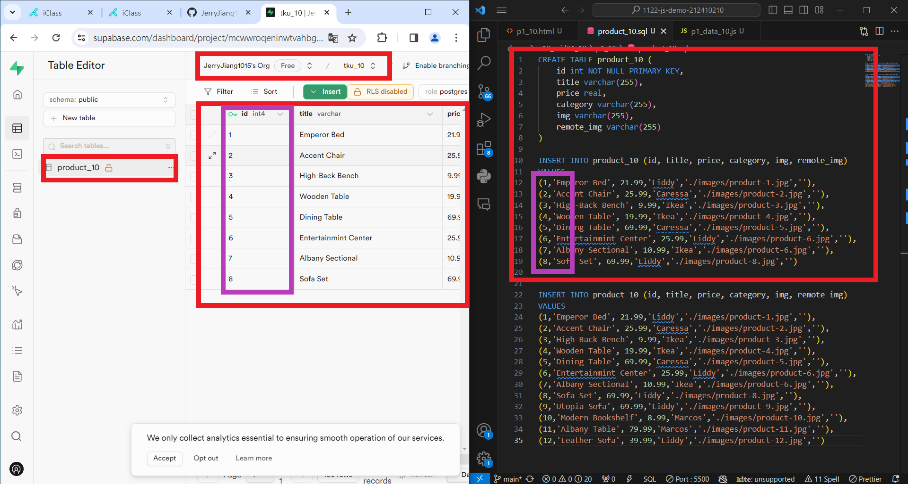
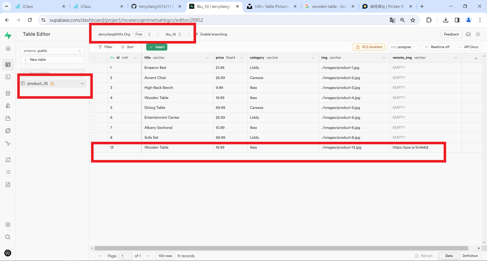
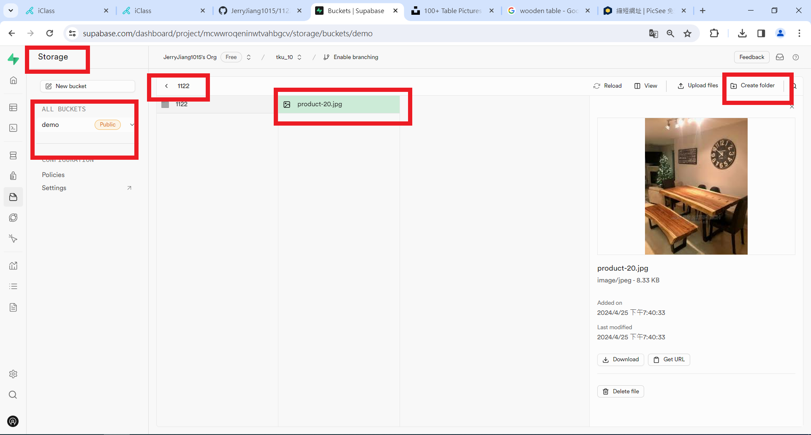
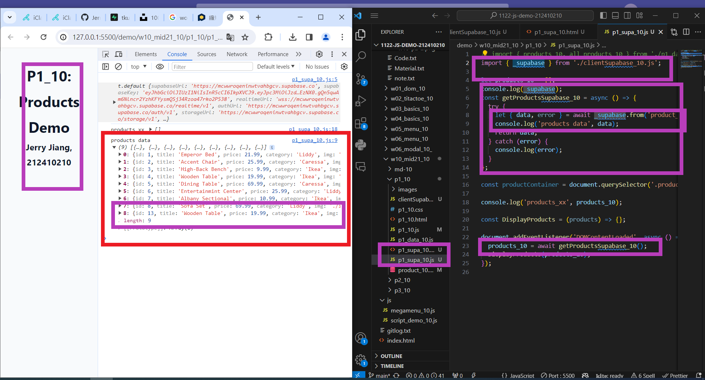
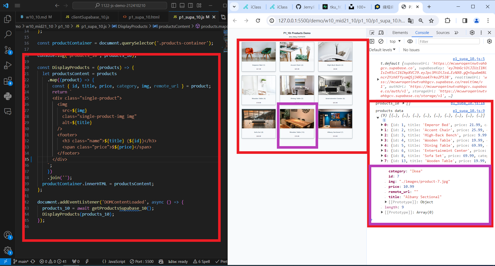
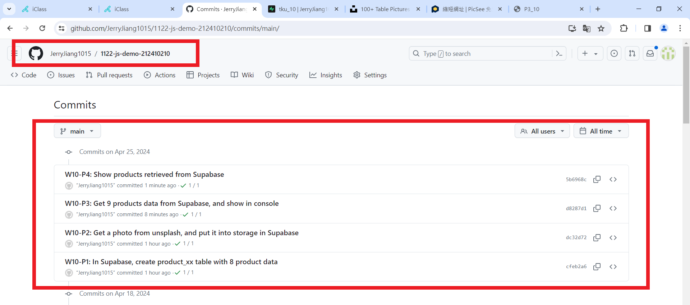

[My Github URL](https://github.com/JerryJiang1015/1122-js-demo-212410210)
[Vercel](https://1122-js-demo-212410210.vercel.app/#)

### W10-P1: In Supabase, create product_xx table with 8 product data



```
$ git log --pretty=format:"%h%x09%an%x09%ad%x09%s" --after="2024-04-24"
cfeb2a6 “JerryJiang1015”        Thu Apr 25 19:23:33 2024 +0800  W10-P1: In Supabase, create product_xx table with 8 product data
```

### W10-P2: Get a photo from unsplash, and put it into storage in Supabase





```
$ git log --pretty=format:"%h%x09%an%x09%ad%x09%s" --after="2024-04-24"
dc32d72 “JerryJiang1015”        Thu Apr 25 19:49:53 2024 +0800  W10-P2: Get a photo from unsplash, and put it into storage in Supabase
cfeb2a6 “JerryJiang1015”        Thu Apr 25 19:23:33 2024 +0800  W10-P1: In Supabase, create product_xx table with 8 product data

```

### W10-P3: Get 9 products data from Supabase, and show in console



```

$ git log --pretty=format:"%h%x09%an%x09%ad%x09%s" --after="2024-03-27"
317a47a “JerryJiang1015”        Thu Mar 28 20:55:53 2024 +0800  W10-P3: implement filter buttons
9a9046a “JerryJiang1015”        Thu Mar 28 20:25:10 2024 +0800  W10-P2: Display Menu
buttons from categories array
c0f6db3 “JerryJiang1015”        Thu Mar 28 19:58:28 2024 +0800  W10-P1: Create categories dynamically from data_10.js

```

### W10-P4: implement open modals



```

$ git log --pretty=format:"%h%x09%an%x09%ad%x09%s" --after="2024-03-27"
7e5698f “JerryJiang1015”        Thu Mar 28 22:03:03 2024 +0800  W10-P4: implement open modals
317a47a “JerryJiang1015”        Thu Mar 28 20:55:53 2024 +0800  W10-P3: implement filter buttons9a9046a “JerryJiang1015”        Thu Mar 28 20:25:10 2024 +0800  W10-P2: Display Menu buttons from categories array
c0f6db3 “JerryJiang1015”        Thu Mar 28 19:58:28 2024 +0800  W10-P1: Create categories dynamically from data_10.js


```

### W10-P4: implement open modals


```

$ git log --pretty=format:"%h%x09%an%x09%ad%x09%s" --after="2024-03-27"
317a47a “JerryJiang1015”        Thu Mar 28 20:55:53 2024 +0800  W10-P3: implement filter buttons
9a9046a “JerryJiang1015”        Thu Mar 28 20:25:10 2024 +0800  W10-P2: Display Menu
buttons from categories array
c0f6db3 “JerryJiang1015”        Thu Mar 28 19:58:28 2024 +0800  W10-P1: Create categories dynamically from data_10.js

```

### W10-P5: implement close modals



```

$ git log --pretty=format:"%h%x09%
an%x09%ad%x09%s" --after="2024-03-27"
b9865fe JerryJiang1015  Sat Mar 30 10:14:43 2024 +0000  W10-P5: implement close modals
1ebba30 JerryJiang1015  Sat Mar 30 09:46:35 2024 +0800  Update index.html
fc9adbf “JerryJiang1015”        Thu Mar 28 22:04:17 2024 +0800  upload
7e5698f “JerryJiang1015”        Thu Mar 28 22:03:03 2024 +0800  W10-P4: implement open modals
317a47a “JerryJiang1015”        Thu Mar 28 20:55:53 2024 +0800  W10-P3: implement filter buttons
9a9046a “JerryJiang1015”        Thu Mar 28 20:25:10 2024 +0800  W10-P2: Display Menu buttons from categories array
c0f6db3 “JerryJiang1015”        Thu Mar 28 19:58:28 2024 +0800  W10-P1: Create categories dynamically from data_10.js
```

### W10-P6: git logs for W10


```

```
