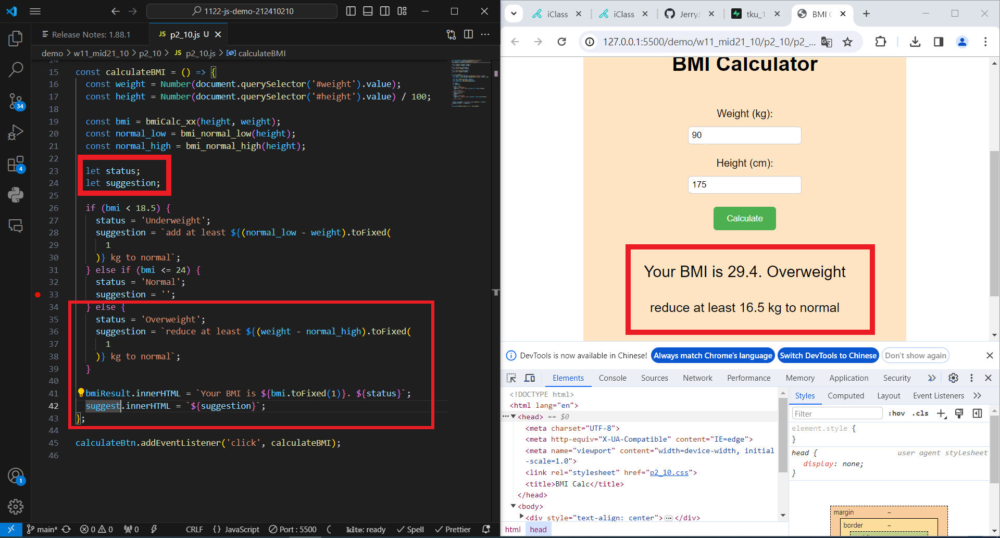
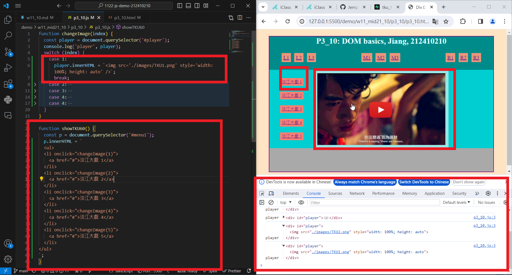
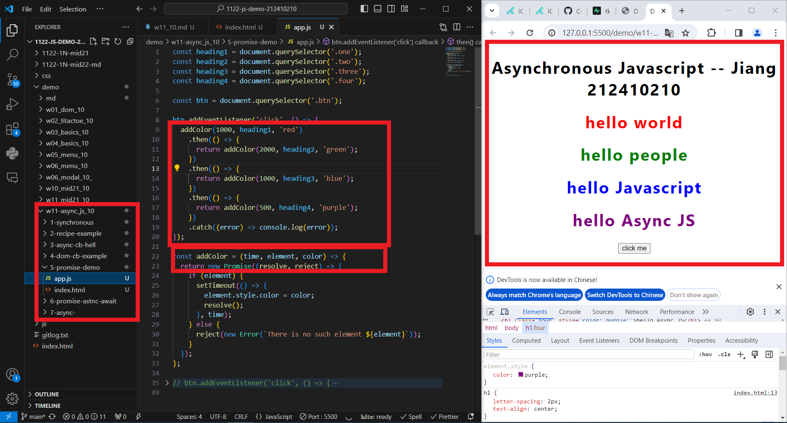
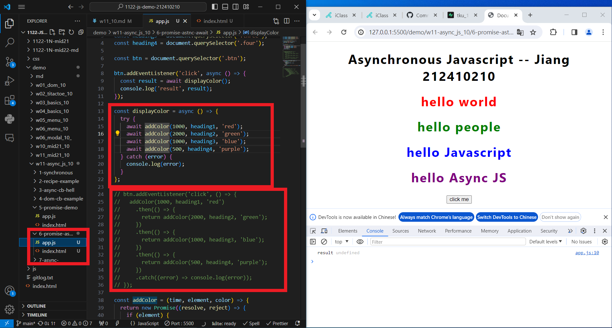
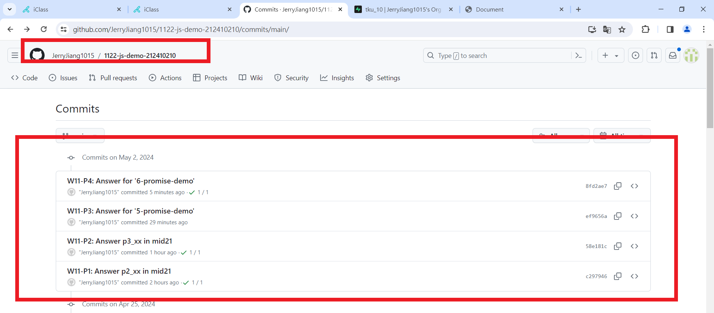

[My Github URL](https://github.com/JerryJiang1115/1122-js-demo-212411211)
[Vercel](https://1122-js-demo-212411211.vercel.app/#)

### W11-P1: W11-P1: Answer p2_xx in mid21



```
$ git log --pretty=format:"%h%x09%an%x09%ad%x09%s" --after="2024-05-01"
c297946 “JerryJiang1015”        Thu May 2 19:11:07 2024 +0800    W11-P1: Answer p2_xx in mid21
```

### W11-P2: W11-P2: Answer p3_xx in mid21



```
$ git log --pretty=format:"%h%x09%an%x09%ad%x09%s" --after="2024-05-01"
58e181c “JerryJiang1015”        Thu May 2 19:35:36 2024 +0800   W11-P2: Answer p3_xx in mid21
c297946 “JerryJiang1015”        Thu May 2 19:11:07 2024 +0800    W11-P1: Answer p2_xx in mid21

```

### W11-P3: Answer for '5-promise-demo'



```
$ git log --pretty=format:"%h%x09%an%x09%ad%x09%s" --after="2024-05-01"
ef9656a “JerryJiang1015”        Thu May 2 20:42:31 2024 +0800   W11-P3: Answer for '5-promise-demo'
58e181c “JerryJiang1015”        Thu May 2 19:35:36 2024 +0800   W11-P2: Answer p3_xx in mid21
c297946 “JerryJiang1015”        Thu May 2 19:11:07 2024 +0800    W11-P1: Answer p2_xx in mid21

```

### W11-P4: Answer for '6-promise-demo'



```

$ git log --pretty=format:"%h%x09%an%x09%ad%x09%s" --after="2024-03-27"
7e5698f “JerryJiang1115”        Thu Mar 28 22:03:03 2024 +0800  W11-P4: implement open modals
317a47a “JerryJiang1115”        Thu Mar 28 20:55:53 2024 +0800  W11-P3: implement filter buttons9a9046a “JerryJiang1115”        Thu Mar 28 20:25:11 2024 +0800  W11-P2: Display Menu buttons from categories array
c0f6db3 “JerryJiang1115”        Thu Mar 28 19:58:28 2024 +0800  W11-P1: Create categories dynamically from data_11.js


```

### W11-P5: git logs for W11



```

```
