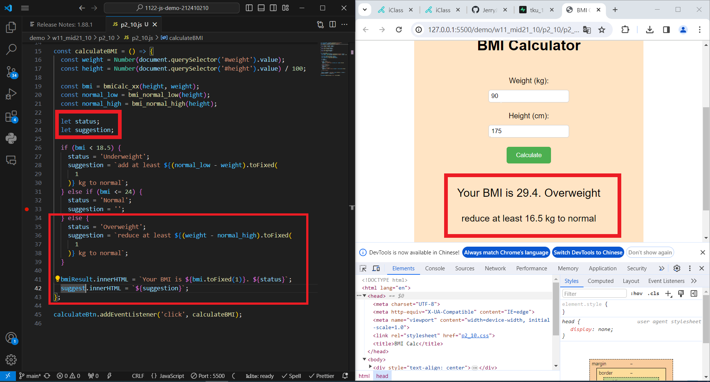

[My Github URL](https://github.com/JerryJiang1115/1122-js-demo-212411211)
[Vercel](https://1122-js-demo-212411211.vercel.app/#)

### W11-P1: W11-P1: Answer p2_xx in mid21



```
$ git log --pretty=format:"%h%x09%an%x09%ad%x09%s" --after="2024-04-24"
cfeb2a6 “JerryJiang1115”        Thu Apr 25 19:23:33 2024 +0800  W11-P1: In Supabase, create product_xx table with 8 product data
```

### W11-P2: Get a photo from unsplash, and put it into storage in Supabase


```
$ git log --pretty=format:"%h%x09%an%x09%ad%x09%s" --after="2024-04-24"
dc32d72 “JerryJiang1115”        Thu Apr 25 19:49:53 2024 +0800  W11-P2: Get a photo from unsplash, and put it into storage in Supabase
cfeb2a6 “JerryJiang1115”        Thu Apr 25 19:23:33 2024 +0800  W11-P1: In Supabase, create product_xx table with 8 product data

```

### W11-P3: Get 9 products data from Supabase, and show in console


```

$ git log --pretty=format:"%h%x09%an%x09%ad%x09%s" --after="2024-04-24"
d8287d1 “JerryJiang1115”        Thu Apr 25 21:01:28 2024 +0800  W11-P3: Get 9 products data from Supabase, and show in console
dc32d72 “JerryJiang1115”        Thu Apr 25 19:49:53 2024 +0800  W11-P2: Get a photo from unsplash, and put it into storage in Supabase
cfeb2a6 “JerryJiang1115”        Thu Apr 25 19:23:33 2024 +0800  W11-P1: In Supabase, create product_xx table with 8 product data

```

### W11-P4: Show products retrieved from Supabase


```

$ git log --pretty=format:"%h%x09%an%x09%ad%x09%s" --after="2024-03-27"
7e5698f “JerryJiang1115”        Thu Mar 28 22:03:03 2024 +0800  W11-P4: implement open modals
317a47a “JerryJiang1115”        Thu Mar 28 20:55:53 2024 +0800  W11-P3: implement filter buttons9a9046a “JerryJiang1115”        Thu Mar 28 20:25:11 2024 +0800  W11-P2: Display Menu buttons from categories array
c0f6db3 “JerryJiang1115”        Thu Mar 28 19:58:28 2024 +0800  W11-P1: Create categories dynamically from data_11.js


```

### W11-P5: git logs for W11


```

```
