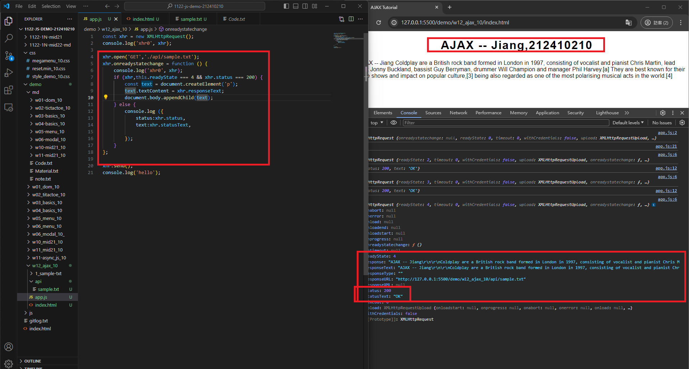
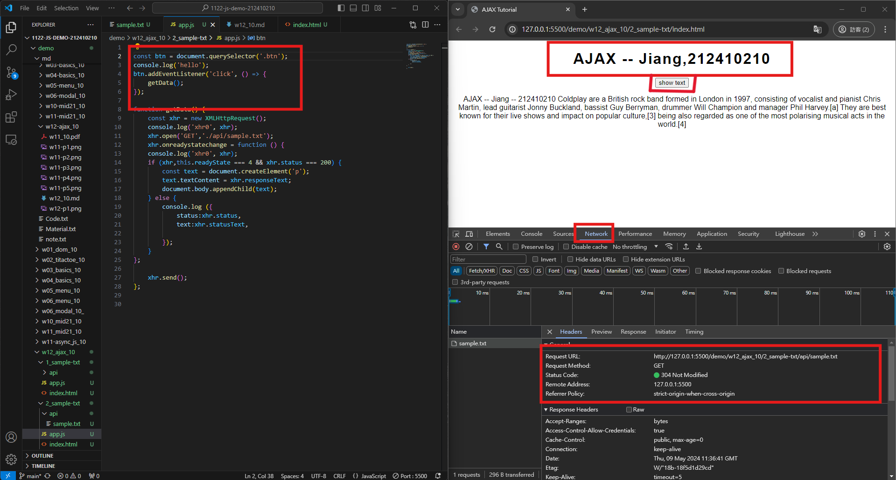
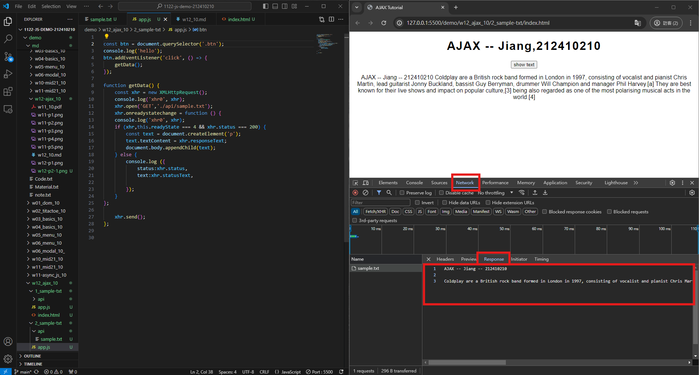
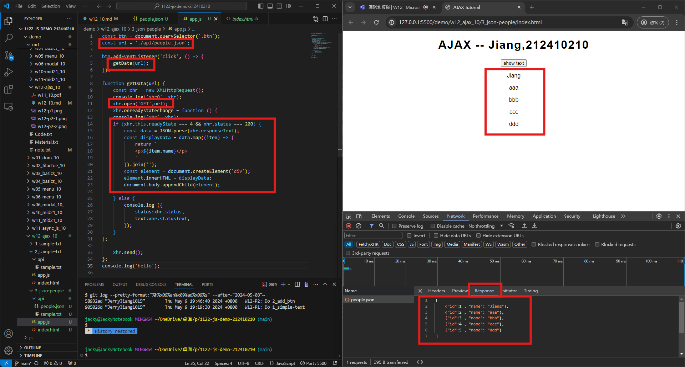
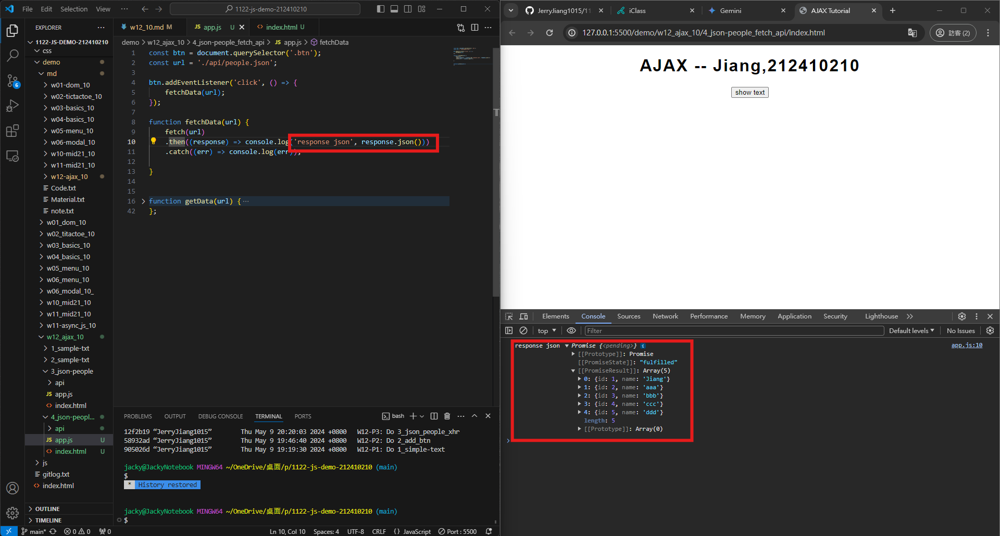
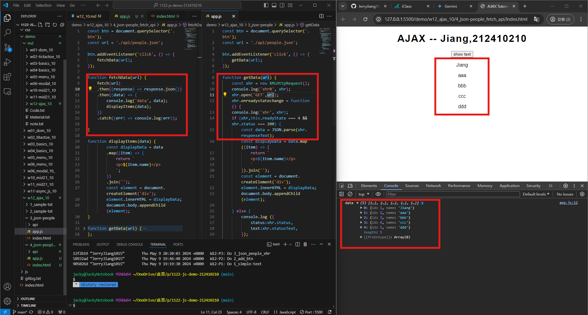
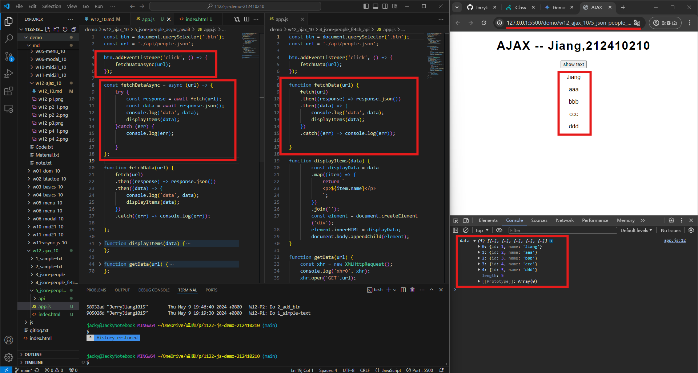

[My Github URL](https://github.com/JerryJiang1115/1122-js-demo-212411211)
[Vercel](https://1122-js-demo-212411211.vercel.app/#)

### W12-P1: Do 1_simple-text



```
$ git log --pretty=format:"%h%x09%an%x09%ad%x09%s" --after="2024-05-08"~
905026d “JerryJiang1015”        Thu May 9 19:19:30 2024 +0800   W12-P1: Do 1_simple-text
```

### W12-P2: Do 2_add_btn
 
#### => Network, Header
 

 
#### => Network, Response
 

 
```
$ git log --pretty=format:"%h%x09%an%x09%ad%x09%s" --after="2024-05-08"~
58932ad “JerryJiang1015”        Thu May 9 19:46:40 2024 +0800   W12-P2: Do 2_add_btn
905026d “JerryJiang1015”        Thu May 9 19:19:30 2024 +0800   W12-P1: Do 1_simple-text

```

### W12-P3: Do 3_json_people_xhr
 


```
$ git log --pretty=format:"%h%x09%an%x09%ad%x09%s" --after="2024-05-08"
12f2b19 “JerryJiang1015”        Thu May 9 20:20:03 2024 +0800   W12-P3: Do 3_json_people_xhr
58932ad “JerryJiang1015”        Thu May 9 19:46:40 2024 +0800   W12-P2: Do 2_add_btn       
905026d “JerryJiang1015”        Thu May 9 19:19:30 2024 +0800   W12-P1: Do 1_simple-text  

```

### W12-P4: Do 3_json_people_fetch_api
 
#### => fetch(url).then(response => response.json())
 

 
#### => fetch api vs.xhr
 


```
$ git log --pretty=format:"%h%x09%an%x09%ad%x09%s" --after="2024-05-01"
8fd2ae7 “JerryJiang1015”        Thu May 2 21:06:31 2024 +0800   W12-P4: Answer for '6-promise-demo'
ef9656a “JerryJiang1015”        Thu May 2 20:42:31 2024 +0800   W12-P3: Answer for '5-promise-demo'
58e181c “JerryJiang1015”        Thu May 2 19:35:36 2024 +0800   W12-P2: Answer p3_xx in mid21
c297946 “JerryJiang1015”        Thu May 2 19:11:07 2024 +0800    W12-P1: Answer p2_xx in mid21

```

### W12-P5: git logs for W12



```

```
