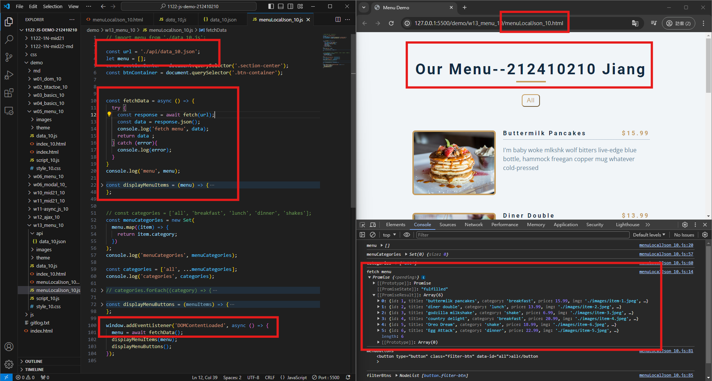
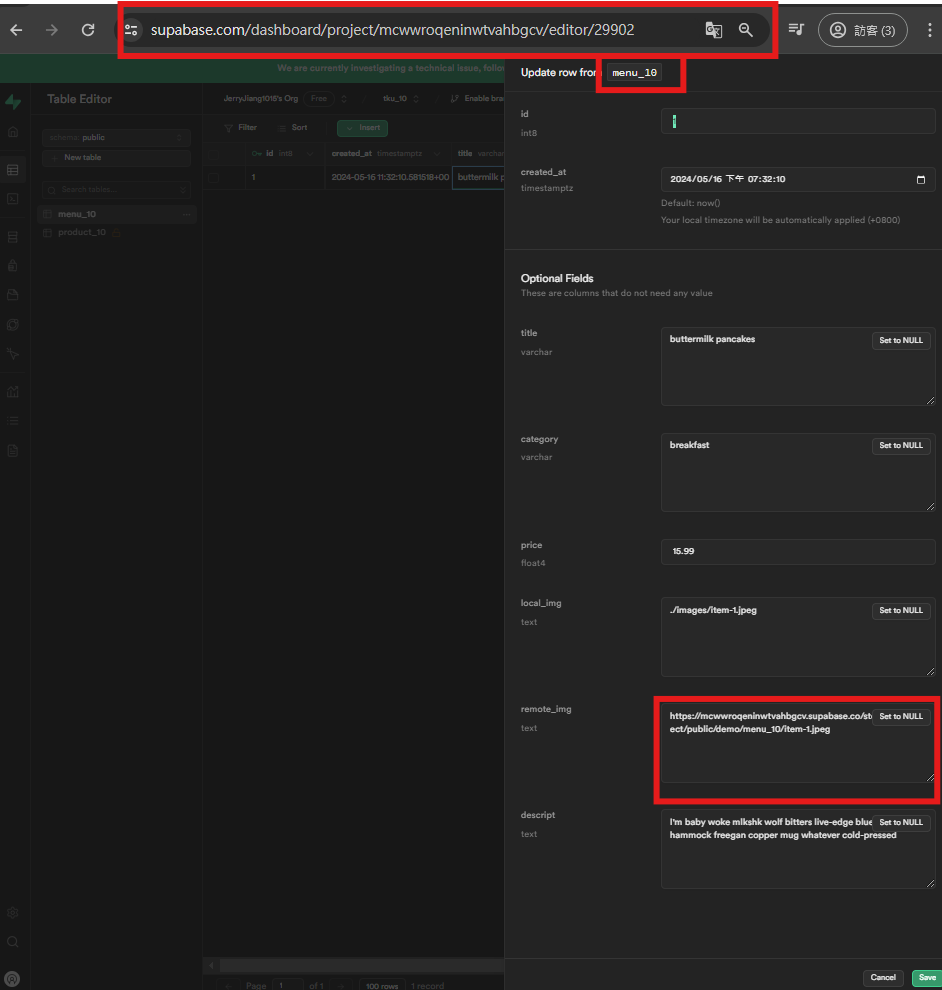
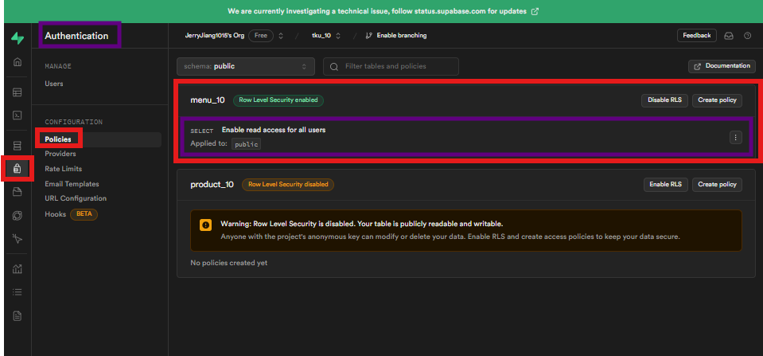
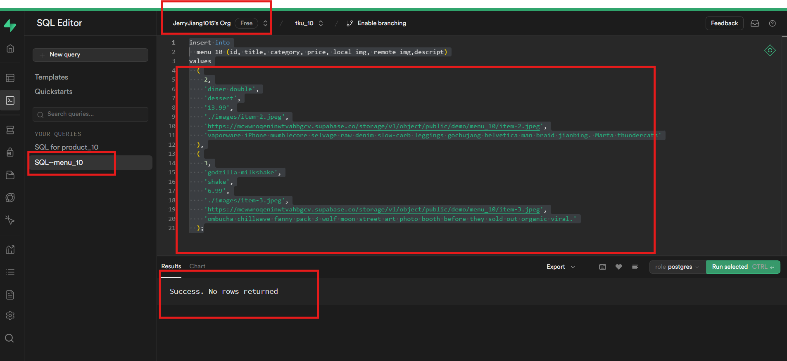
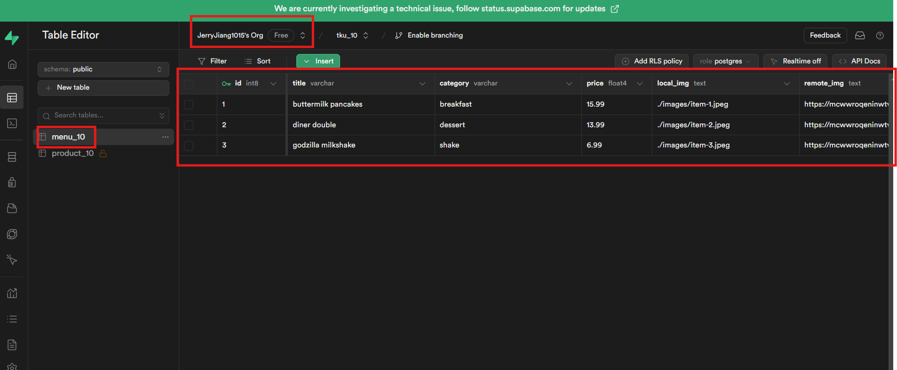
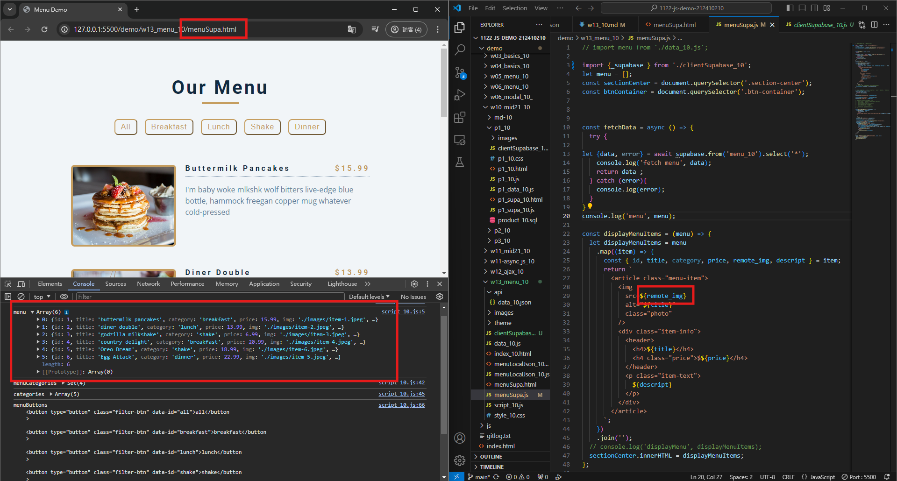
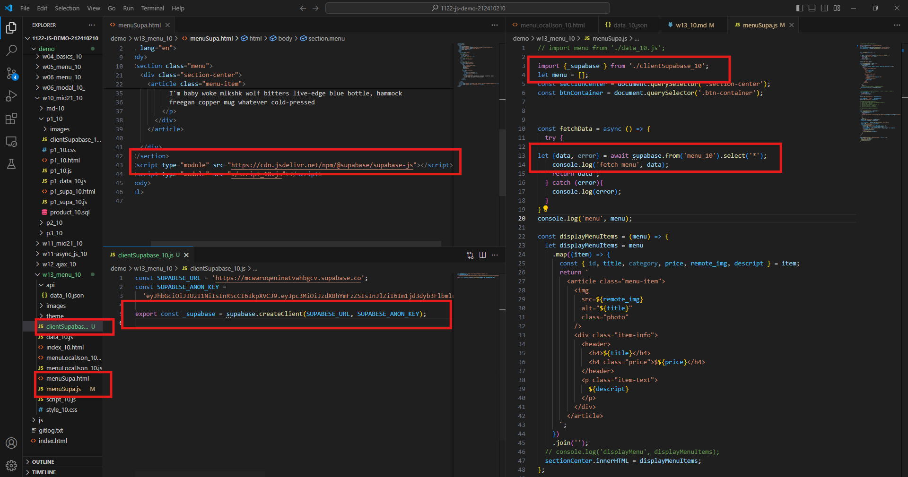

[My Github URL](https://github.com/JerryJiang1115/1122-js-demo-212411211)
[Vercel](https://1122-js-demo-212411211.vercel.app/#)

### W13-P1: 0
 


```
$ git log --pretty=format:"%h%x09%an%x09%ad%x09%s" --after="2024-05-15"
de90ad4 “JerryJiang1015”        Thu May 16 19:20:20 2024 +0800  Get 3 menu data from /api/data_10.json
```

### W13-P2: Create 3 menu data from Supabase
 
#### => create menu_xx table, and add 1 menu data
 

 
#### => add RLS read policy for public access
 

 
#### => add two more menu data from SQL command
 

 
#### => show 3 menu data from menu_xx table
 

 
```
$ git log --pretty=format:"%h%x09%an%x09%ad%x09%s" --after="2024-05-08"~
58932ad “JerryJiang1015”        Thu May 9 19:46:40 2024 +0800   W12-P2: Do 2_add_btn
905026d “JerryJiang1015”        Thu May 9 19:19:30 2024 +0800   W12-P1: Do 1_simple-text

```

### W13-P3: Use menuSupa.html, menuSupa.js to get 3 menu data from Supabase
 

 

 
```
$ git log --pretty=format:"%h%x09%an%x09%ad%x09%s" --after="2024-05-08"
12f2b19 “JerryJiang1015”        Thu May 9 20:20:03 2024 +0800   W12-P3: Do 3_json_people_xhr
58932ad “JerryJiang1015”        Thu May 9 19:46:40 2024 +0800   W12-P2: Do 2_add_btn       
905026d “JerryJiang1015”        Thu May 9 19:19:30 2024 +0800   W12-P1: Do 1_simple-text  

```

### W12-P4: Do 3_json_people_fetch_api
 
#### => fetch(url).then(response => response.json())
 

 
#### => fetch api vs.xhr
 


```
$ git log --pretty=format:"%h%x09%an%x09%ad%x09%s" --after="2024-05-08"
4f3d17f “JerryJiang1015”        Thu May 9 20:49:48 2024 +0800   W12-P4: Do 3_json_people_fetch_api
12f2b19 “JerryJiang1015”        Thu May 9 20:20:03 2024 +0800   W12-P3: Do 3_json_people_xhr
58932ad “JerryJiang1015”        Thu May 9 19:46:40 2024 +0800   W12-P2: Do 2_add_btn
905026d “JerryJiang1015”        Thu May 9 19:19:30 2024 +0800   W12-P1: Do 1_simple-text

```

### W12-P5: Do 3_json_people_async_await
 


```
$ git log --pretty=format:"%h%x09%an%x09%ad%x09%s" --after="2024-05-08"
d358a97 “JerryJiang1015”        Thu May 9 21:09:44 2024 +0800   W12-P5: Do 3_json_people_async_await
4f3d17f “JerryJiang1015”        Thu May 9 20:49:48 2024 +0800   W12-P4: Do 3_json_people_fetch_api     
12f2b19 “JerryJiang1015”        Thu May 9 20:20:03 2024 +0800   W12-P3: Do 3_json_people_xhr
58932ad “JerryJiang1015”        Thu May 9 19:46:40 2024 +0800   W12-P2: Do 2_add_btn
905026d “JerryJiang1015”        Thu May 9 19:19:30 2024 +0800   W12-P1: Do 1_simple-text

```
### W12-P6: git logs for W12


```

```
