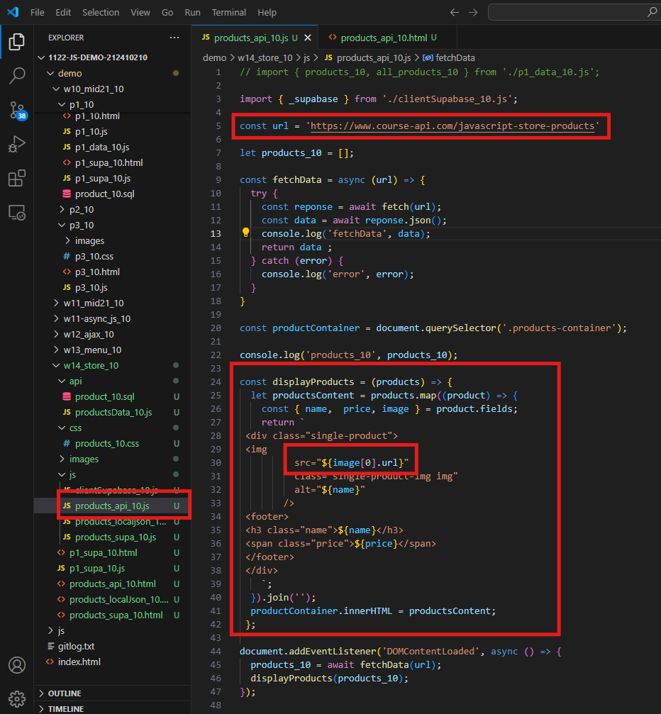
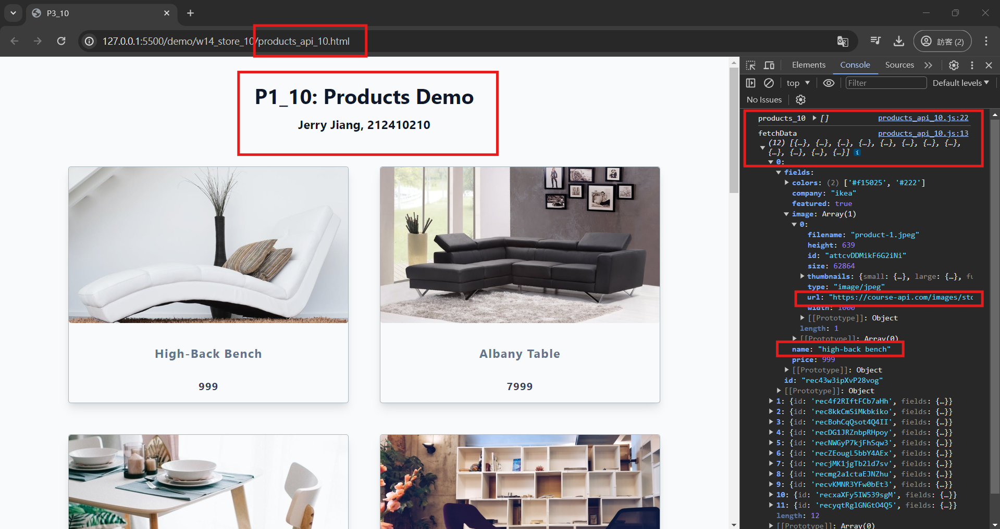
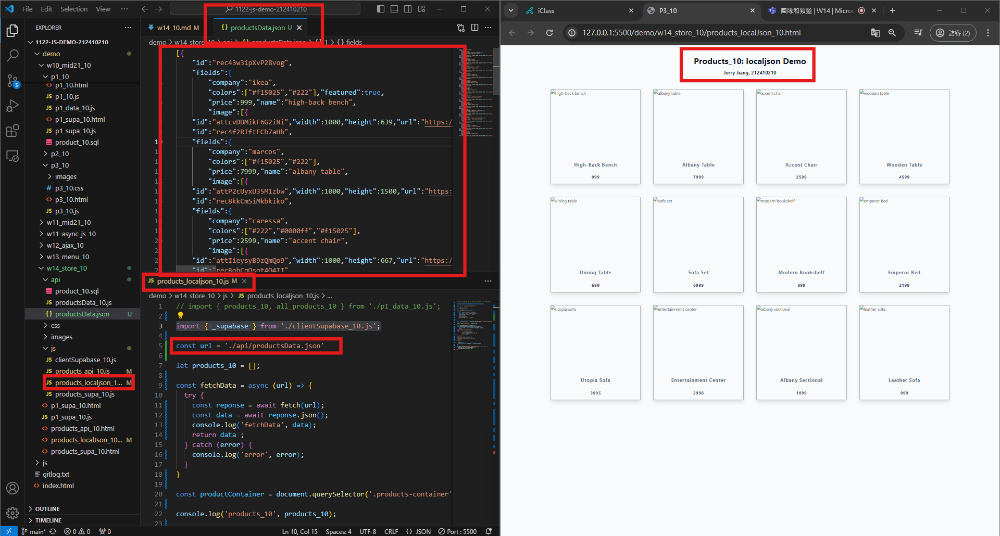
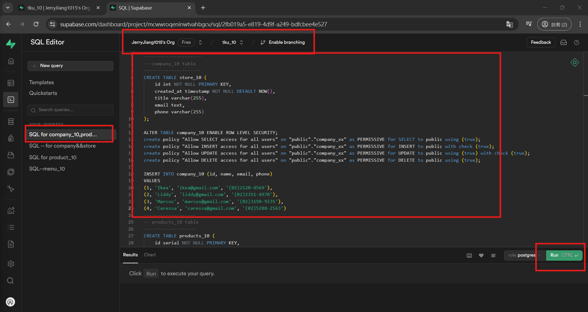
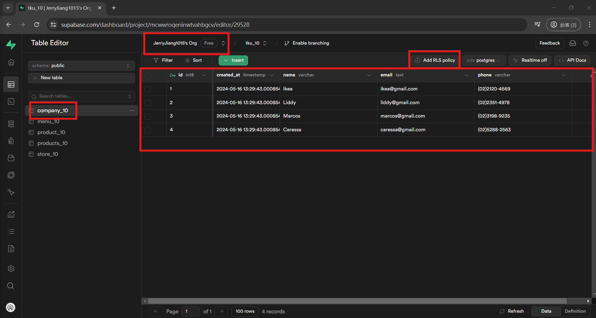
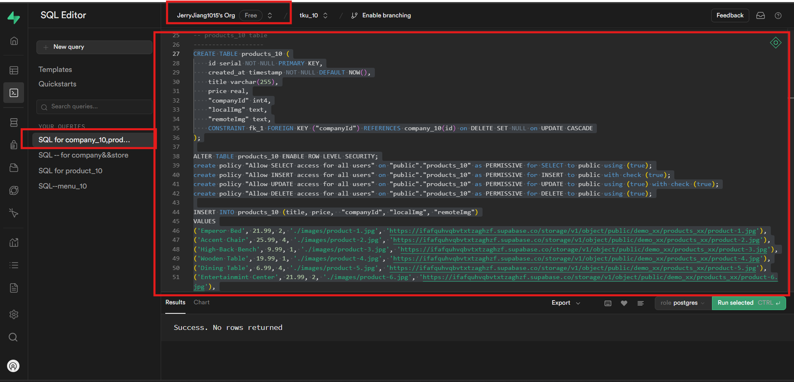
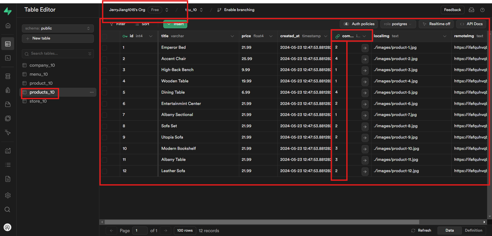
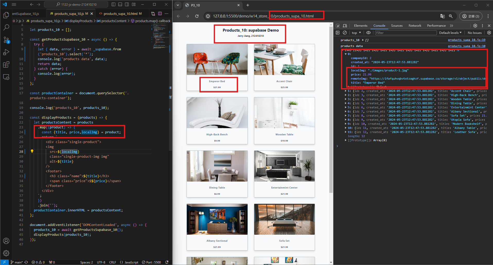
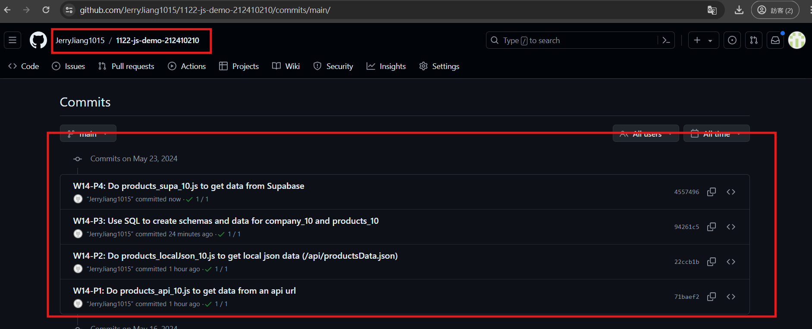

[My Github URL](https://github.com/JerryJiang1115/1122-js-demo-212411211)
[Vercel](https://1122-js-demo-212411211.vercel.app/#)

### W14-P1: Do products_api_10.js to get data from an api url
 

 

 

```
$ git log --pretty=format:"%h%x09%an%x09%ad%x09%s" --after="2024-05-22"
71baef2 “JerryJiang1015”        Thu May 23 19:22:19 2024 +0800  W14-P1: Do products_api_10.js to get data from an api url
```

### W14-P2: Do products_localJson_10.js to get local json data (/api/productsData.json)
 

 
```
$ git log --pretty=format:"%h%x09%an%x09%ad%x09%s" --after="2024-05-22"
22ccb1b “JerryJiang1015”        Thu May 23 19:54:39 2024 +0800  W14-P2: Do products_localJson_10.js to get local json data (/api/productsData.json)
71baef2 “JerryJiang1015”        Thu May 23 19:22:19 2024 +0800  W14-P1: Do products_api_10.js to get data from an api url

```

### W14-P3: Use SQL to create schemas and data for company_10 and products_10
 
#### => company_10 schema and data
 

 

 
#### => products_10 schema and data
 

 

 
```
$ git log --pretty=format:"%h%x09%an%x09%ad%x09%s" --after="2024-05-22"
94261c5 “JerryJiang1015”        Thu May 23 20:49:53 2024 +0800  W14-P3: Use SQL to create schemas and data for company_10 and products_10
22ccb1b “JerryJiang1015”        Thu May 23 19:54:39 2024 +0800  W14-P2: Do products_localJson_10.js to get local json data (/api/productsData.json)
71baef2 “JerryJiang1015”        Thu May 23 19:22:19 2024 +0800  W14-P1: Do products_api_10.js to get data from an api url

```

### W14-P4: Do products_supa_10.js to get data from Supabase
 

 
```
$ git log --pretty=format:"%h%x09%an%x09%ad%x09%s" --after="2024-05-15"
16bb583 “JerryJiang1015”        Thu May 16 21:36:51 2024 +0800  W13-P4: Create company_10 and store_10 tables, and insert all data
f6dfe80 “JerryJiang1015”        Thu May 16 20:45:00 2024 +0800  W13-P3: Use menuSupa.html, menuSupa.js to get 3 menu data from Supabase
f6f7af5 “JerryJiang1015”        Thu May 16 20:37:41 2024 +0800  W13-P2: Create 3 menu data from Supabase
de90ad4 “JerryJiang1015”        Thu May 16 19:20:20 2024 +0800  Get 3 menu data from /api/data_10.json

```

### W14-P5: git logs for W14
 


```


```