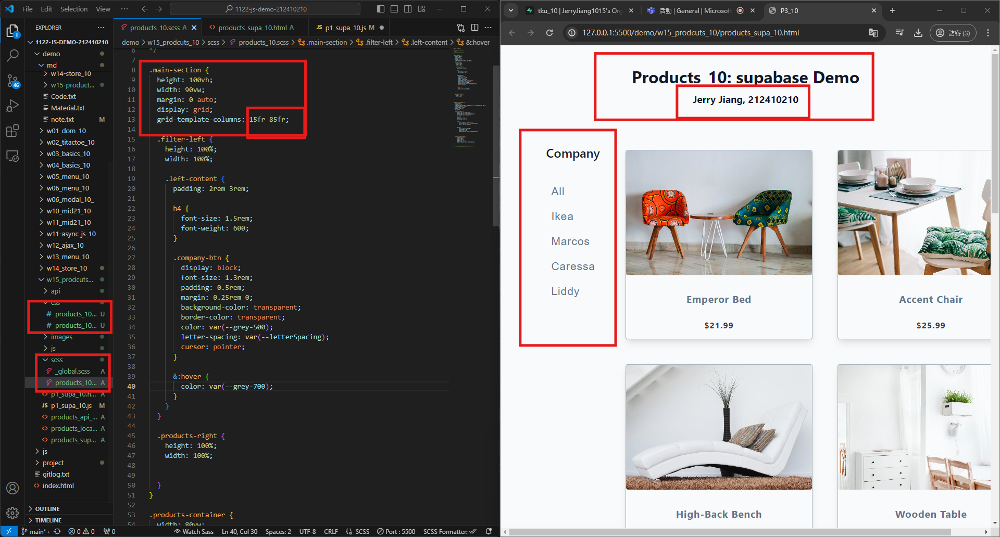
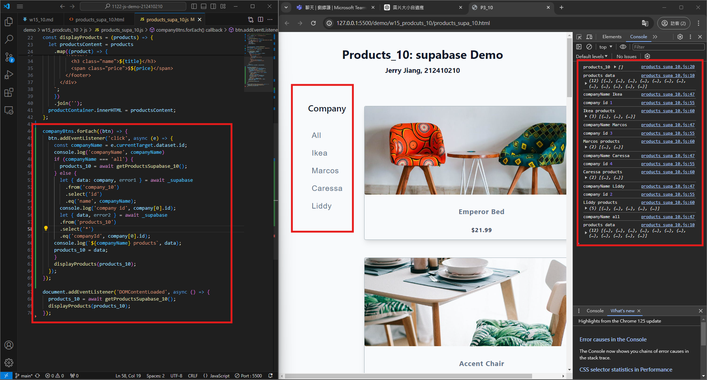
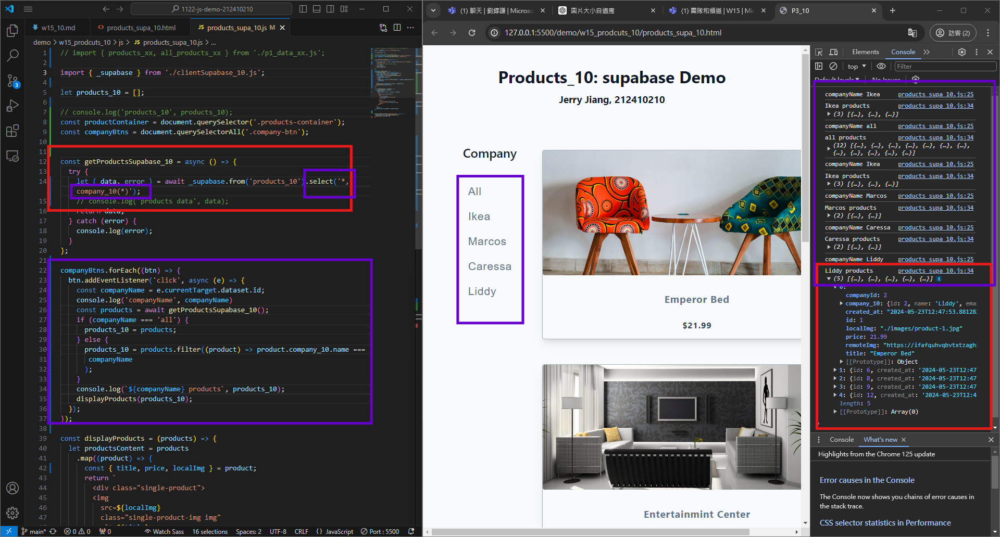
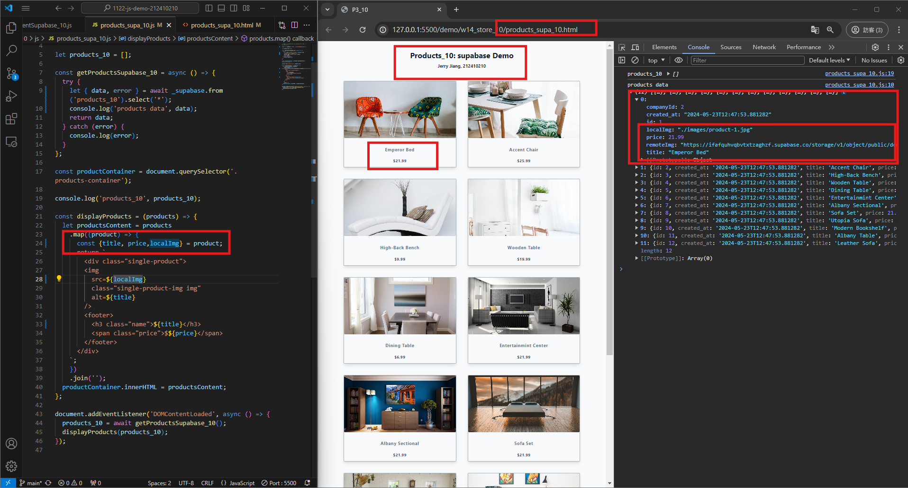
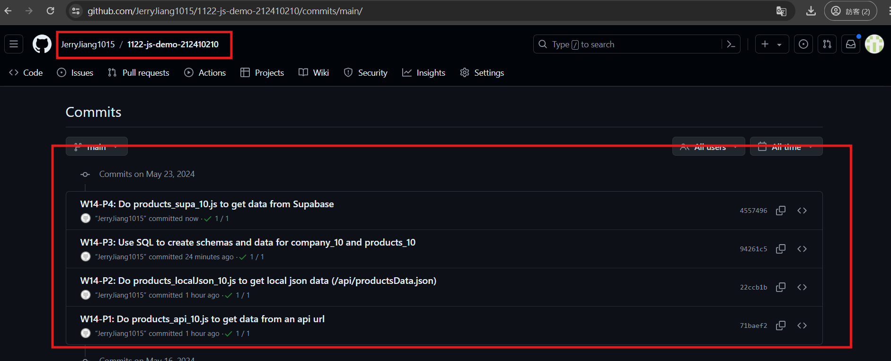

[My Github URL](https://github.com/JerryJiang1015/1122-js-demo-212410210)
[Vercel](https://1122-js-demo-212411210.vercel.app/#)

### W15-P1: Create company (filter) menu using scss
 

 

```
$ git log --pretty=format:"%h%x09%an%x09%ad%x09%s" --after="2024-05-29"

c7ba084 “JerryJiang1015”        Thu May 30 19:23:41 2024 +0800  W15-P1: Create company (filter) menu using scss
```

### W15-P2: Implement company filter functions, test for each company
 

 
```
$ git log --pretty=format:"%h%x09%an%x09%ad%x09%s" --after="2024-05-22"
22ccb1b “JerryJiang1015”        Thu May 23 19:54:39 2024 +0800  W14-P2: Do products_localJson_10.js to get local json data (/api/productsData.json)
71baef2 “JerryJiang1015”        Thu May 23 19:22:19 2024 +0800  W14-P1: Do products_api_10.js to get data from an api url

```

### W15-P3: Implement company filter functions, test for each company using direct filtering of the products containing company data
 

 
 
```
$ git log --pretty=format:"%h%x09%an%x09%ad%x09%s" --after="2024-05-22"
94261c5 “JerryJiang1015”        Thu May 23 20:49:53 2024 +0800  W14-P3: Use SQL to create schemas and data for company_10 and products_10
22ccb1b “JerryJiang1015”        Thu May 23 19:54:39 2024 +0800  W14-P2: Do products_localJson_10.js to get local json data (/api/productsData.json)
71baef2 “JerryJiang1015”        Thu May 23 19:22:19 2024 +0800  W14-P1: Do products_api_10.js to get data from an api url

```

### W14-P4: Do products_supa_10.js to get data from Supabase
 

 
```
$ git log --pretty=format:"%h%x09%an%x09%ad%x09%s" --after="2024-05-22"
4557496 “JerryJiang1015”        Thu May 23 21:13:55 2024 +0800  W14-P4: Do products_supa_10.js to get data from Supabase
94261c5 “JerryJiang1015”        Thu May 23 20:49:53 2024 +0800  W14-P3: Use SQL to create schemas and data for company_10 and products_10
22ccb1b “JerryJiang1015”        Thu May 23 19:54:39 2024 +0800  W14-P2: Do products_localJson_10.js to get local json data (/api/productsData.json)
71baef2 “JerryJiang1015”        Thu May 23 19:22:19 2024 +0800  W14-P1: Do products_api_10.js to get data from an api url

```

### W14-P5: git logs for W14
 


```


```