[My Github URL](https://github.com/JerryJiang1015/1122-js-demo-212410210)

[Vercel](https://1122-js-demo-212411211.vercel.app/#)
## API Project 簡要說明

### 重點 1
### 建立圖片資料、排列圖片，並加入簡易動畫 & 連結

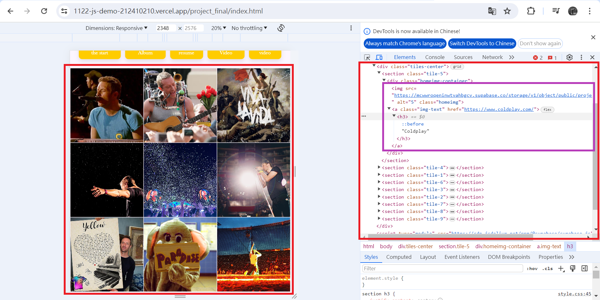

### CSS
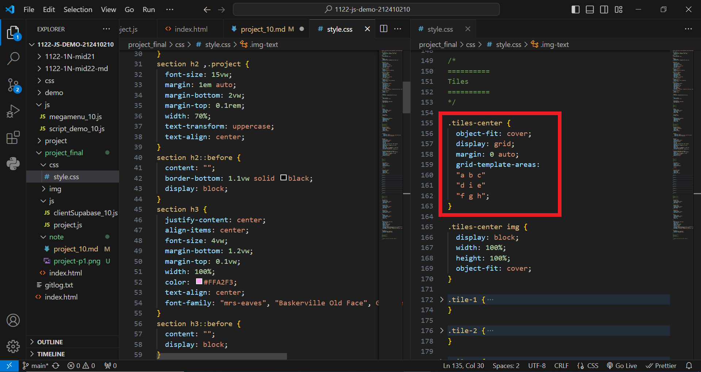
### JavaScript
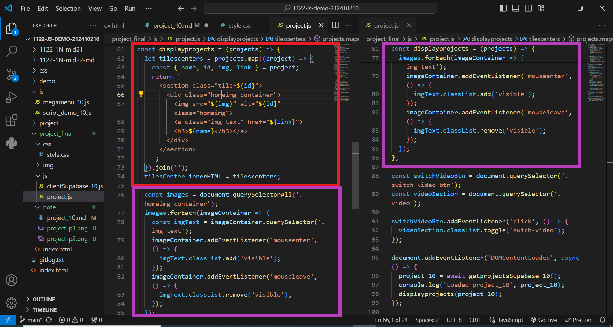
### Supabase
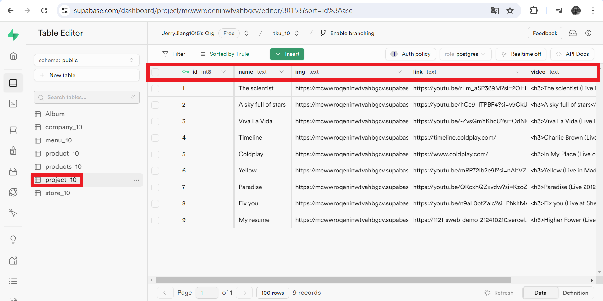
### 重點 2
### Btn 建立 & 連結

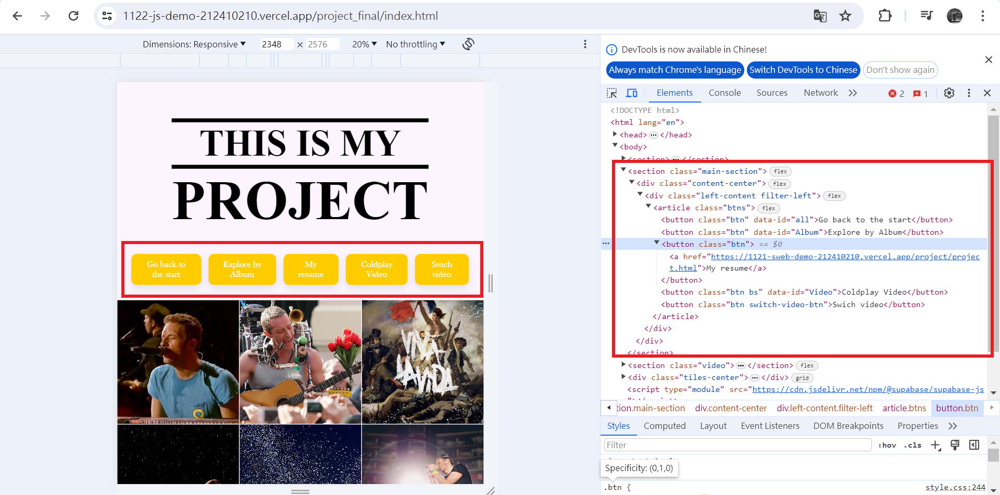

### HTML
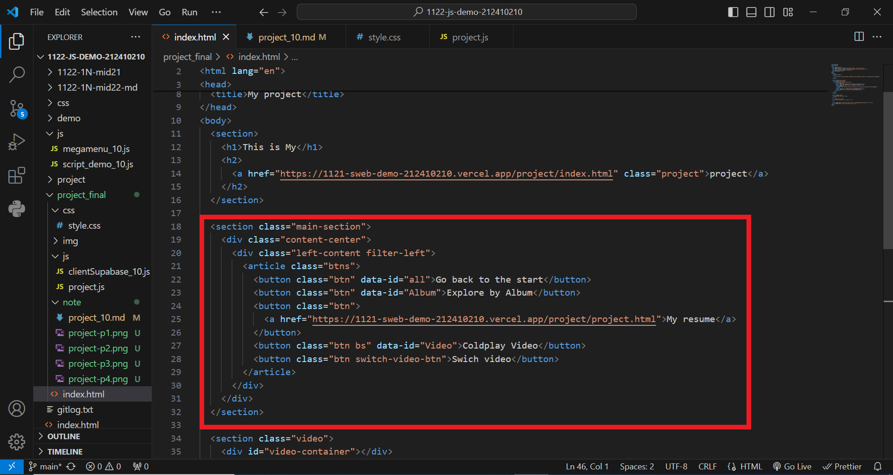
### JavaScript
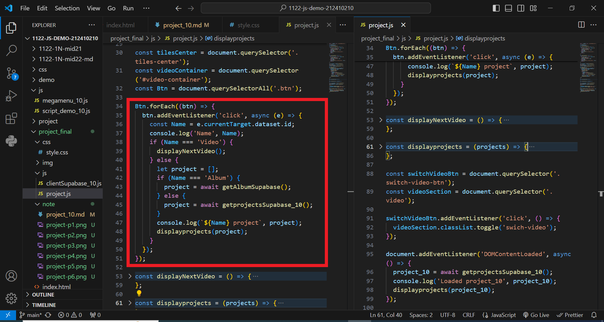

### 重點 3
### 圖片、資料 置換

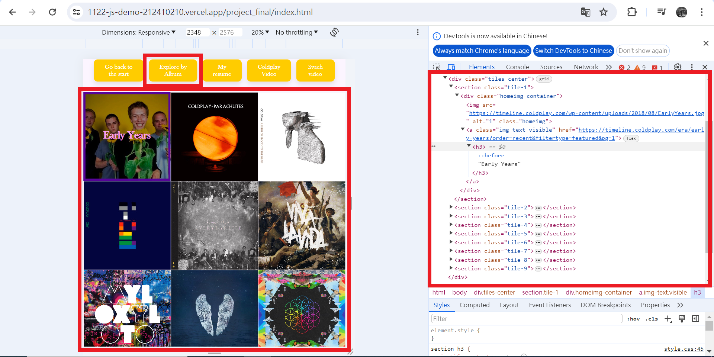

### JavaScript
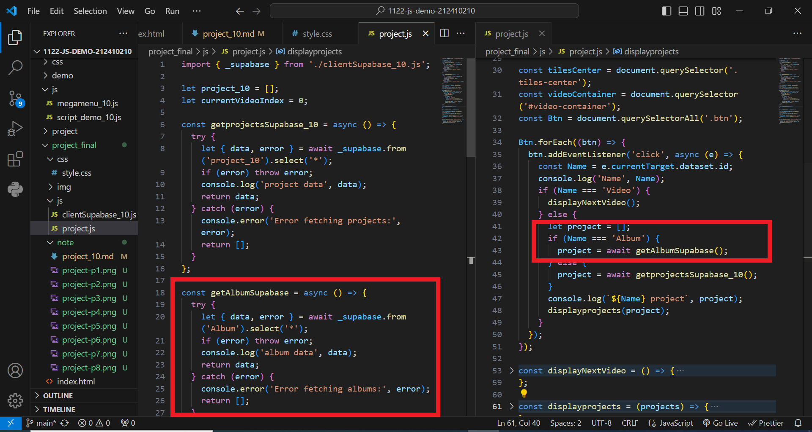
### Supabase
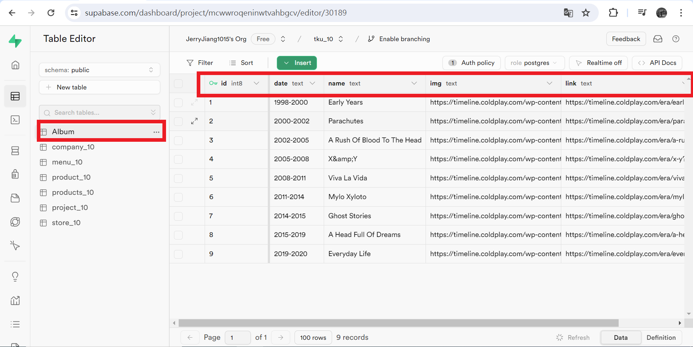

### 重點 4
### 引入 Youtube 嵌入式影片

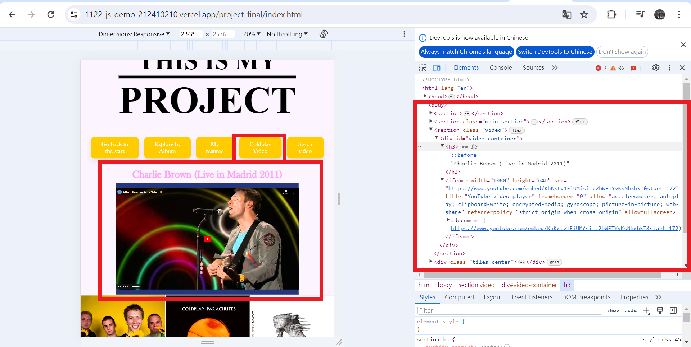

### JavaScript
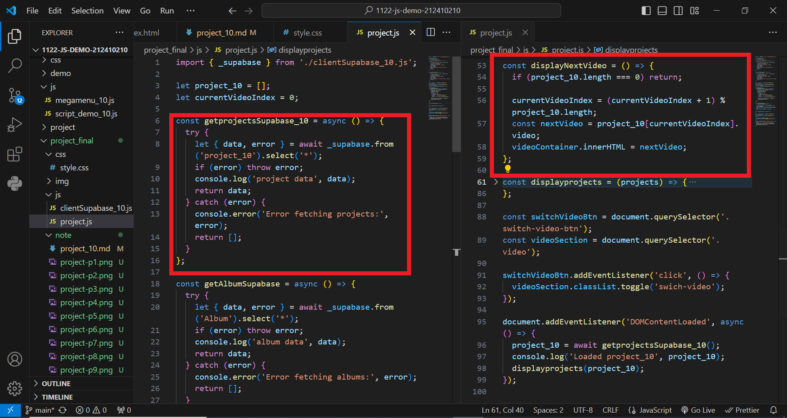
### Supabase
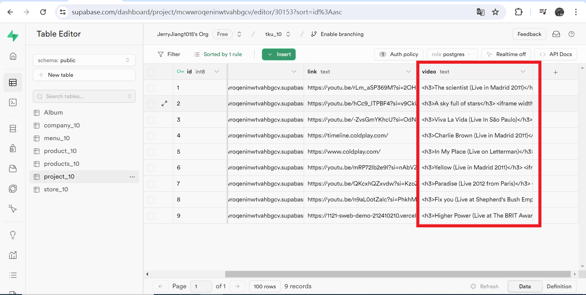

### 重點 5
### 重整 & 影片顯示

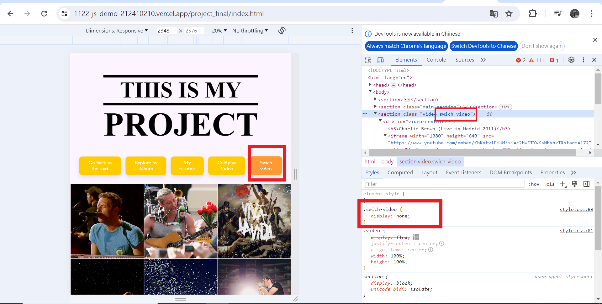

### CSS & JavaScript
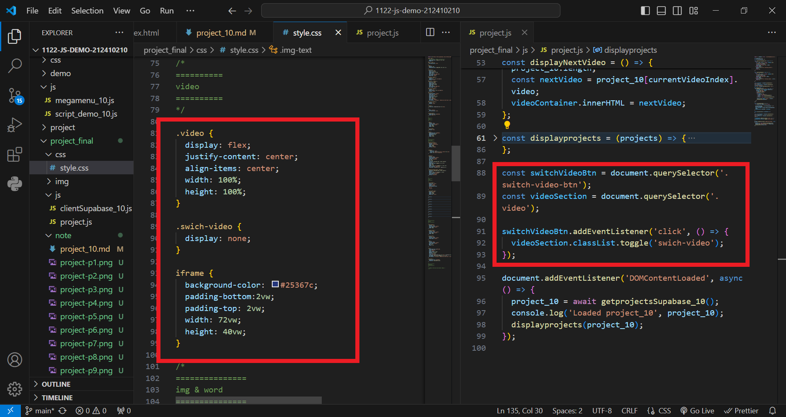

---

## API 資料及網路資源來源說明

### 網路資源來源 1
### 圖片 & 影片
[Coldplay](https://www.coldplay.com/)

[Coldplay timeline](https://timeline.coldplay.com/)

### 網路資源來源 2
### 程式碼校正
[ChatGPT](https://chatgpt.com/)

---

## 後端 Supabase 資料庫設計

### SQL schema and data

#### => table 1

#### => table 2


#### => 提供執行一次就可重新建立 schema 及 data 之 SQL 指令
```
-----
project_10 table
-----
CREATE TABLE project_10 (
    id int NOT NULL PRIMARY KEY,
    name text,
    img text,
    link text,
    video text
);

INSERT INTO project_10 (id, name, img, link, video)
VALUES
(1, 'The scientist', 'https://mcwwroqeninwtvahbgcv.supabase.co/storage/v1/object/public/project/coldplay/coldplay_1.png?t=2024-05-30T16%3A06%3A46.205Z', 'https://youtu.be/rLm_aSP369M?si=2OHilXRRFqfeqTNP','<h3>The scientist (Live in Madrid 2011)</h3>
<iframe width="1080" height="640" src="https://www.youtube.com/embed/rLm_aSP369M?si=Z6HdOhkSEESFdJgA" title="YouTube video player" frameborder="0" allow="accelerometer; autoplay; clipboard-write; encrypted-media; gyroscope; picture-in-picture; web-share" referrerpolicy="strict-origin-when-cross-origin" allowfullscreen></iframe>'),
(2, 'A sky full of stars', 'https://mcwwroqeninwtvahbgcv.supabase.co/storage/v1/object/public/project/coldplay/coldplay_2.png', 'https://youtu.be/hCc9_ITPBF4?si=v9CkU7ExPakyGJAO','<h3>A sky full of stars</h3>
<iframe width="1080" height="640" src="https://www.youtube.com/embed/hCc9_ITPBF4?si=j8iGtl0dstfinL0G" title="YouTube video player" frameborder="0" allow="accelerometer; autoplay; clipboard-write; encrypted-media; gyroscope; picture-in-picture; web-share" referrerpolicy="strict-origin-when-cross-origin" allowfullscreen></iframe>'),
(3, 'Viva La Vida', 'https://mcwwroqeninwtvahbgcv.supabase.co/storage/v1/object/public/project/coldplay/coldplay_3.png', 'https://youtu.be/-ZvsGmYKhcU?si=OdNK_IU3CX_v-krL','<h3>Viva La Vida (Live In São Paulo)</h3>
<iframe width="1080" height="640" src="https://www.youtube.com/embed/j82L3pLjb_0?si=XqISIJ2GKr3e6ZyG&amp;start=172" title="YouTube video player" frameborder="0" allow="accelerometer; autoplay; clipboard-write; encrypted-media; gyroscope; picture-in-picture; web-share" referrerpolicy="strict-origin-when-cross-origin" allowfullscreen></iframe>'),
(4, 'Timeline', 'https://mcwwroqeninwtvahbgcv.supabase.co/storage/v1/object/public/project/coldplay/coldplay_6.png', 'https://timeline.coldplay.com/','<h3>Charlie Brown (Live in Madrid 2011)</h3>
<iframe width="1080" height="640" src="https://www.youtube.com/embed/KhKxtv1FiUM?si=c2bWFTYvKsNhxhkT&amp;start=172" title="YouTube video player" frameborder="0" allow="accelerometer; autoplay; clipboard-write; encrypted-media; gyroscope; picture-in-picture; web-share" referrerpolicy="strict-origin-when-cross-origin" allowfullscreen></iframe>'),
(5, 'Coldplay', 'https://mcwwroqeninwtvahbgcv.supabase.co/storage/v1/object/public/project/coldplay/coldplay_5.png', 'https://www.coldplay.com/','<h3>In My Place (Live on Letterman)</h3>
<iframe width="1080" height="640" src="https://www.youtube.com/embed/qgLEDSUZ9iQ?si=kuiGGLITG0O4-Fmo" title="YouTube video player" frameborder="0" allow="accelerometer; autoplay; clipboard-write; encrypted-media; gyroscope; picture-in-picture; web-share" referrerpolicy="strict-origin-when-cross-origin" allowfullscreen></iframe>'),
(6, 'Yellow', 'https://mcwwroqeninwtvahbgcv.supabase.co/storage/v1/object/public/project/coldplay/coldplay_4.png', 'https://youtu.be/mRP72Ib2e9I?si=nAbVZPPygus36NHs','<h3>Yellow (Live in Madrid 2011)</h3>
<iframe width="1080" height="640" src="https://www.youtube.com/embed/mRP72Ib2e9I?si=NRfLwhEvAYqir-Od&amp;start=172" title="YouTube video player" frameborder="0" allow="accelerometer; autoplay; clipboard-write; encrypted-media; gyroscope; picture-in-picture; web-share" referrerpolicy="strict-origin-when-cross-origin" allowfullscreen></iframe>'),
(7, 'Paradise', 'https://mcwwroqeninwtvahbgcv.supabase.co/storage/v1/object/public/project/coldplay/coldplay_7.png', 'https://youtu.be/QKcxhQZxvdw?si=KzoZS8xxm3sUzzQr','<h3>Paradise (Live 2012 from Paris)</h3>
<iframe width="1080" height="640" src="https://www.youtube.com/embed/QKcxhQZxvdw?si=L36ZZPB3tg4ERdV9&amp;start=172" title="YouTube video player" frameborder="0" allow="accelerometer; autoplay; clipboard-write; encrypted-media; gyroscope; picture-in-picture; web-share" referrerpolicy="strict-origin-when-cross-origin" allowfullscreen></iframe>')
(8, 'Fix you', 'https://mcwwroqeninwtvahbgcv.supabase.co/storage/v1/object/public/project/coldplay/coldplay_9.png', 'https://youtu.be/n9aL0otZalc?si=PhkhMA0q0IzpXWtA','<h3>Fix you (Live at Shepherd`s Bush Empire)</h3>
<iframe width="1080" height="640" src="https://www.youtube.com/embed/n9aL0otZalc?si=kp4AZbnurJPmc9S9&amp;start=172" title="YouTube video player" frameborder="0" allow="accelerometer; autoplay; clipboard-write; encrypted-media; gyroscope; picture-in-picture; web-share" referrerpolicy="strict-origin-when-cross-origin" allowfullscreen></iframe>'),
(9, 'My resume', 'https://mcwwroqeninwtvahbgcv.supabase.co/storage/v1/object/public/project/coldplay/coldplay.png', 'https://1121-sweb-demo-212410210.vercel.app/project/project.html','<h3>Higher Power (Live at The BRIT Awards, London 2021)</h3>
<iframe width="1080" height="640" src="https://www.youtube.com/embed/kiqEEr7CK2g?si=foD21dfwaVb94bLX&amp;start=172" title="YouTube video player" frameborder="0" allow="accelerometer; autoplay; clipboard-write; encrypted-media; gyroscope; picture-in-picture; web-share" referrerpolicy="strict-origin-when-cross-origin" allowfullscreen></iframe>')

ALTER TABLE company_10 ENABLE ROW LEVEL SECURITY;
create policy "Allow SELECT access for all users" on "public"."project_10" as PERMISSIVE for SELECT to public using (true);

-----
Album table
-----
CREATE TABLE project_10 (
    id int NOT NULL PRIMARY KEY,
    date text,
    name text,
    img text,
    link text
);

INSERT INTO Album (id, date, name, img, link)
VALUES

(1,'1998-2000', 'Early Years','https://timeline.coldplay.com/wp-content/uploads/2018/08/EarlyYears.jpg','https://timeline.coldplay.com/era/early-years?order=recent&filtertype=featured&pg=1'),
(2,'2000-2002', 'Parachutes','https://timeline.coldplay.com/wp-content/uploads/2018/08/parachutes.jpg','https://timeline.coldplay.com/era/parachutes?order=recent&filtertype=featured&pg=1'),
(3,'2002-2005', 'A Rush Of Blood To The Head','https://timeline.coldplay.com/wp-content/uploads/2018/08/ARushofBloodToTheHead.jpg','https://timeline.coldplay.com/era/a-rush-of-blood-to-the-head?order=recent&filtertype=featured&pg=1'),
(4,'2005-2008', 'X&amp;Y','https://timeline.coldplay.com/wp-content/uploads/2018/08/XY.jpg','https://timeline.coldplay.com/era/x-y?order=recent&filtertype=featured&pg=1'),
(5,'2008-2011', 'Viva La Vida','https://timeline.coldplay.com/wp-content/uploads/2018/10/Viva_La-Vida.jpg','https://timeline.coldplay.com/era/viva-la-vida?order=recent&filtertype=featured&pg=1'),
(6,'2011-2014', 'Mylo Xyloto','https://timeline.coldplay.com/wp-content/uploads/2018/10/coldplay___mylo_xyloto__alternate_album_cover_1__by_rrpjdisc-d7oe37h.jpg','https://timeline.coldplay.com/era/mylo-xyloto?order=recent&filtertype=featured&pg=1'),
(7,'2014-2015', 'Ghost Stories','https://timeline.coldplay.com/wp-content/uploads/2018/08/GhostStories.jpg','https://timeline.coldplay.com/era/ghost-stories?order=recent&filtertype=featured&pg=1'),
(8,'2015-2019', 'A Head Full Of Dreams','https://timeline.coldplay.com/wp-content/uploads/2018/10/AHFOD1000-2.jpg','https://timeline.coldplay.com/era/a-head-full-of-dreams?order=recent&filtertype=featured&pg=1'),
(9,'2019-2020	', 'Everyday Life','https://timeline.coldplay.com/wp-content/uploads/2020/07/EverydayLife_artwork.jpg','./images/product-20.jpg','https://timeline.coldplay.com/era/everyday-life?order=recent&filtertype=featured&pg=1')

ALTER TABLE company_10 ENABLE ROW LEVEL SECURITY;
create policy "Allow SELECT access for all users" on "public"."Album" as PERMISSIVE for SELECT to public using (true);

```

### 前端程式設計說明

### 整體HTML
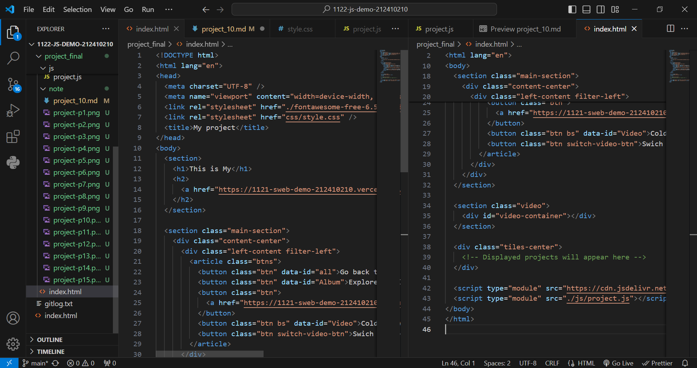

### Image & Text 設計


#### => 功能 1
### 圖片Tiles
### CSS

### JavaScript


#### => 功能 2
### 按鈕設計
### HTML

### CSS

### JavaScript


#### => 功能 3
### 圖片、資料 置換
### JavaScript


#### => 功能 4
### 引入 Youtube 嵌入式影片
### JavaScript

#### => 功能 5
### 重整 & 影片顯示
### CSS & JavaScript

---

### 解決問題說明

#### => 問題 1 : 圖片從Supbase與CSS連結異常
#### => 解決 : 固定每張圖片tiles
##### 另外方法 grid-template-columns: repeat(,);


#### => 問題 2 : 第二個按鈕的字會有跑版問題
#### => 解決 : 只好縮一點的字體大小


#### => 問題 3 : 按鈕無法正常操控圖片置換
#### => 解決 : 用另一個Supabase Table 讓資料分開


#### => 問題 4 : 影片用JavaScript return HTML 的方式會有無法單一控制的障礙
#### => 解決 : 將整段嵌入式影片代碼放上Supabase


#### => 問題 5 : 影片如果在播放後按Btn，影片只是隱藏
#### => 解決 : 有想到能將影片改為空字串，但發現便背景音樂是意外


---

### 學習甘苦談

#### => 1.一開始設計圖片排列嘗試好多種引入方法，最終為了版面大小暫定

#### => 2.在按鈕的部分遇到的障礙比較少，比較大的問題是設定變數

#### => 3.在引入另一組圖片，當初構想能設計像是Coldpaly timeline 的拉動式，但是發現我給自己製造了大麻煩

#### => 4.影片這段最初構想就想嘗試製作，沒想到也是我花最多時間研究的部分

